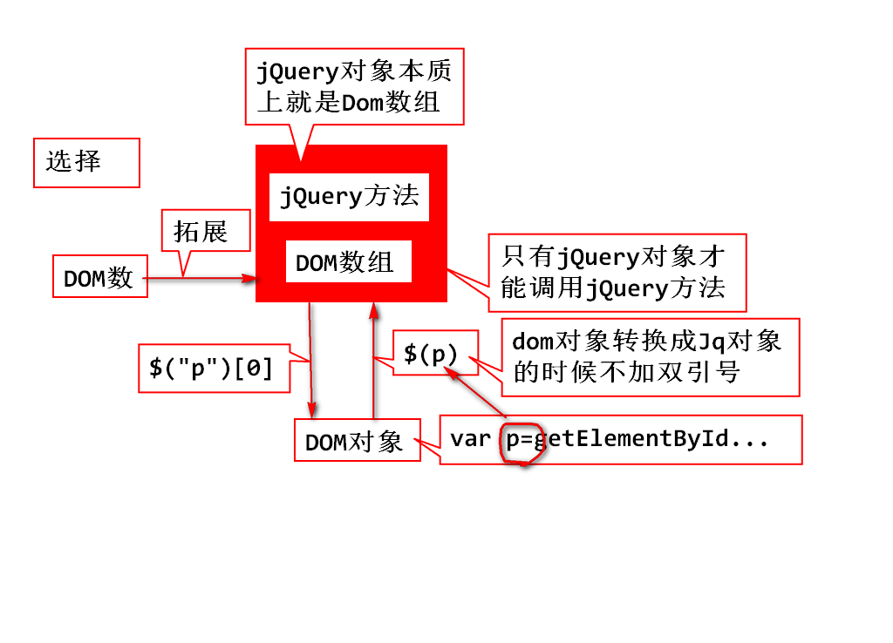

## jQuery：

- 第一个Demo演示：
   	

   	<title>一个JQuery的小Demo</title>
   	
   		
   	
   		
   	
   	</head>
   	
   	<body>
   	
   		<input type="button" value="+" onclick="bigger();">
   	
   		
jQuery是一个JavaScript库

   	
   		
jQuery极大的简化了JavaScript编程

   	
   		
jQuery非常容易学

   	
   	</body>	
   	

## jQuery对象详解：

- jQuery对象本质上是DOM数组；

- dom对象转jQuery：  $(p)         括号里面不写双引号即为封装p标签为jQuery对象元素之一；

	 jQuery转dom：	  $("p")[0]    加双引号并写下标元素，就能找到对应的标签;

- 只有jQuery对象才能调用jQuery方法:
		        $("p").innerHTML;             //输出：undefined (错误：)
		$("p")[0].innerHTML;          //输出："jQuery是一个JavaScript库"  (正确)
		$("p")[0].css("font-size");    //输出报错 ()
		$("p").css("font-size");        //输出："18px" (正确)

## jQuery常用选择器:
- jQuery选择器可以准确选取到你希望找到的元素.

- 选择器允许你的HTML元素组或者单个元素进行操作.
   $(function(){});   等同于: window.load(){function(){}}

- 基本选择器：
   $("li");		  //li标签的样式
   	$(".sz");		      //匹配类名为sz的标签样式
   	$("#jms");	      //匹配id为jms的标签样式
   	$("ul li");	              //匹配ul下所有的li的标签样式
   	$("ul .sz");	      //匹配ul下的类名为sz的标签样式
   	$("ul>#jms");	      //匹配ul下的id为jms的标签样式

- 层次选择器：
           $("#gz+");	     //匹配它的弟弟(就是它本人位置的下一个)
   	$("#gz~");	     //匹配它的弟弟们
   	$("#gz+li");            //匹配它的标签名为li的弟弟而非必须下一个.

   #### 过滤选择器：
  1. 基本过滤器：
      $("li:first");    //匹配给它一个条件为：first(第一个)的li	
      	 $("li:lt(2)");	//匹配给他一个条件为：lt(2)的li--》其意思为：下标小于2的前两个li
      	 $("li:not(#gz)"); //匹配除id为gz的其他所有标签
      	 - ：first			匹配第一个元素  
      	 - ：last		     匹配最后一个元素
      	 - ：not(selector)	匹配把selector排除在外    *常用*
      	 - ：even			 匹配挑偶数行
      	 - ：odd			  匹配挑奇数行
      	 - ：eq(index)		匹配下标等于index的元素    *常用*
      	 - ：gt(index)		匹配下标大 于index的元素
      	 - ：lt(index)		匹配下标小于index的元素

  2. 内容过滤器：
               $("li:empty");           //匹配li标签内容为空的li
      	 $("li:contains('州')");  //匹配li标签内容包含'州'的li

  3. 可见性过滤器：
      $("li:hidden");		  //匹配被样式隐藏的标签

  4. 属性过滤器(不是冒号开头，是中括号[])：
      <li style="...."></li>
      	 $("li[style]");		   //匹配所有带style属性的li标签
      	 $("[style]");			 //匹配所有带style属性的标签
      	 $("[href='#']");		  //匹配带有href属性并且值为'#'
      	 $("[href!='#']");		 //匹配带有href属性并且值不为'#'
      	 $("[href$='.jpg']");	  //匹配带有href属性并且值为'.jpg'结尾
      	 //此处里面的 $ 表示的意思为正则表达式的 $(结尾)

  5. 状态过滤器：
      <input type="text" disabled="disabled">     //不可用，不可操作状态
      	 <input type="text" readonly="readonly">     //只读状态
      	
      	 <input type="radio" name="gender" checked="checked">男   //默认选中状态
      	 <input type="radio" name="gender">女 
      	 
      	 $("input:disabled");  //匹配input标签其状态为:disabled的input标签。
      	 $("input:checked");   //匹配input标签其状态为:checked的input标签。

- 表单选择器：
		          $(":text");		//匹配文本框
		 $(":password");	//匹配密码框
		 $(":radio");	   //匹配单选框
		 $(":checkbox");	//匹配多选框
		 $(":submit");	  //匹配提交按钮
		 $(":reset");	   //匹配重置按钮
		 $(":button");	  //匹配普通按钮
		 $(":file");		//匹配文件框
		 $(":hidden");	  //匹配隐藏框

## jQuery操作DOM
- jQuery对内容和值得操作.
           var obj = obj.html();
   	obj.html("123");

   	var str = obj.text();
   	obj.text("123");
   	
   	var str = obj.val();
   	obj.val("abc");
   	
   	obj.attr("属性名");
   	obj.attr("属性名","属性值");

- jQuery增删节点.
  1. 创建新节点：
     	 var oSpan = $("你好，jQuery框架");

  2. 挂到DOM树上：
  	  parent.append(oSpan);   //做为最后一个子节点添加进来.
  	 parent.prepend(oSpan);  //做为第一个子节点添加进来
  	 brother.before(oSpan);  //做为上一个兄弟节点
  	 brother.after(oSpan);   //做为下一个兄弟节点

  3. 删除节点：
  	  obj.remove();             //删除这个节点
  	 obj.remove(selector);     //只删除满足selector条件的节点
  		

### 样式操作：add remove has css toggle
		 obj.addClass("样式类名");     相当于   dom.className="";
		 obj.removeClass("样式类名");  移除指定的样式
		 obj.removeClass();           移除所有的样式
		 obj.hasClass("样式名");       判断是否有某个样式
		 obj.toggleClass("样式名");    切换样式(有样式就删了，没有就添上)
		 obj.css("样式属性","样式的值") 设置具体样式
		 obj.css("样式属性");          获得具体样式的值
	 
		$(function(){
			setInterval(function(){
				 $("p").toggleClass("big").toggleClass("red");	
			},50)
		});

### jQuery方法的返回值
- 任何通过$得到的对象都是jQuery对象
  1. 选择器过滤器  $("p")
  2. 转型： Dom -->jQuery对象 $(Dom)

- 修改方法一般都返回jQuery对象:
		obj.html("abc")
		obj.attr("src","../img/06.png")
		obj.addClass("red").removeClass("red")

- 查询到的元素一般都是jQuery对象

- 读取到的文字，返回值是string对象
		obj.val();
		obj.html();
		obj.text();

- 万能确认对象的方式：
		控制台输出，看对象结构

