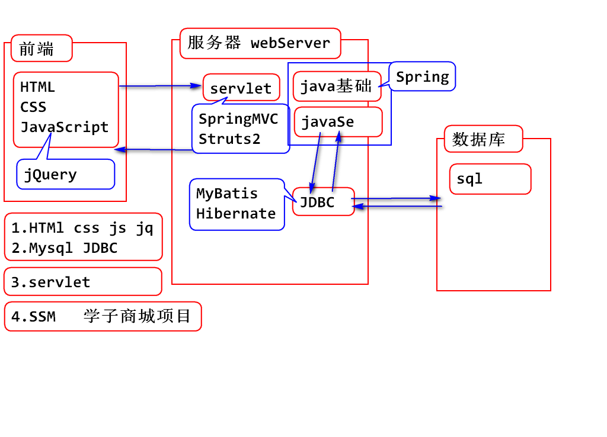
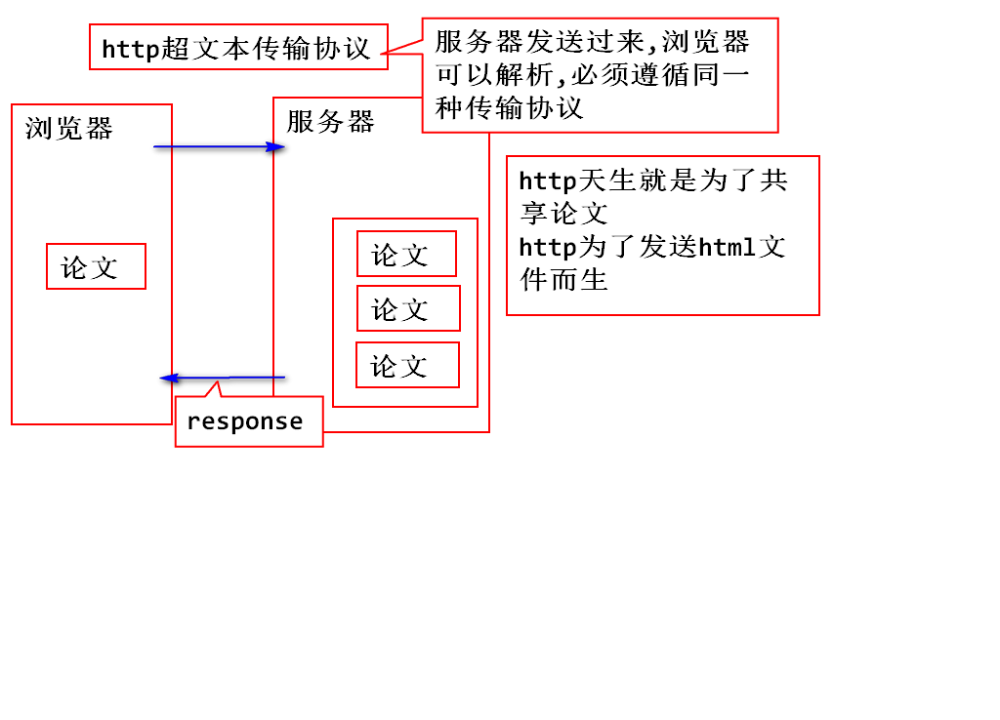
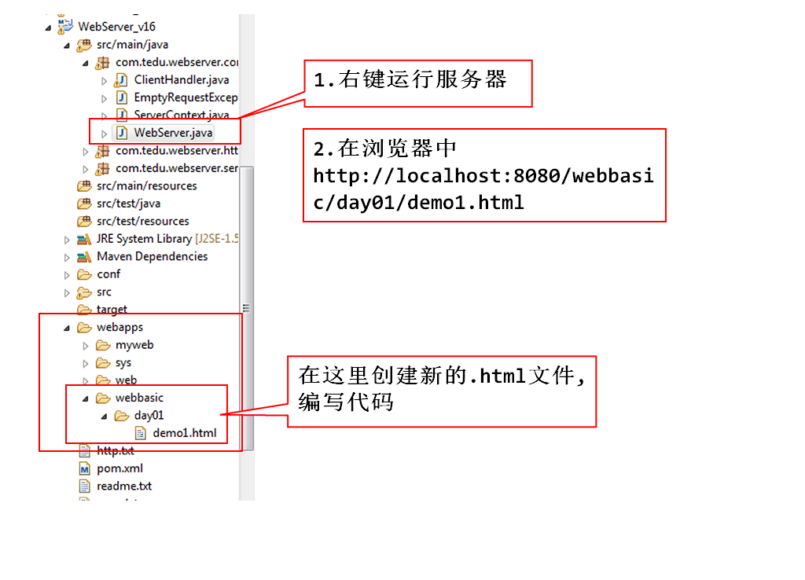
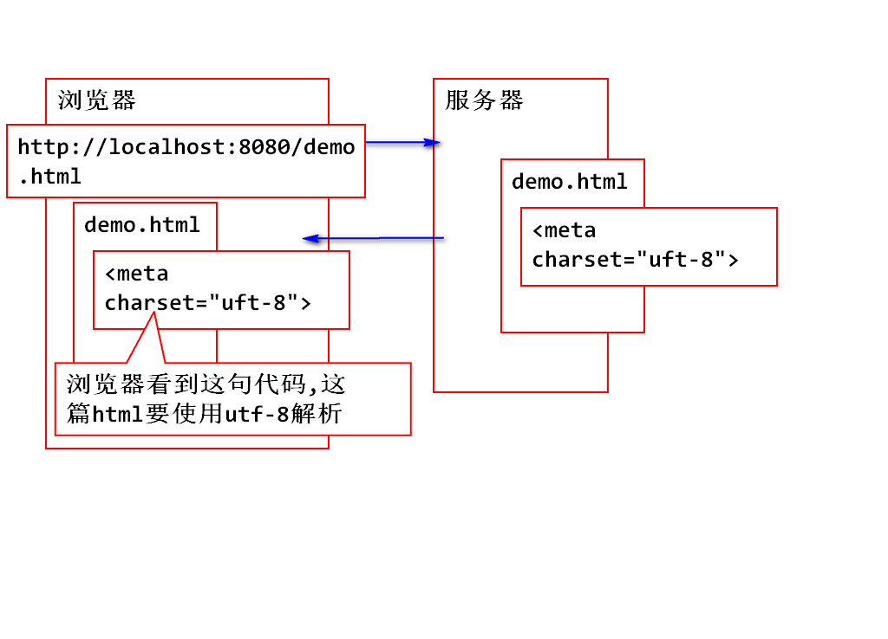
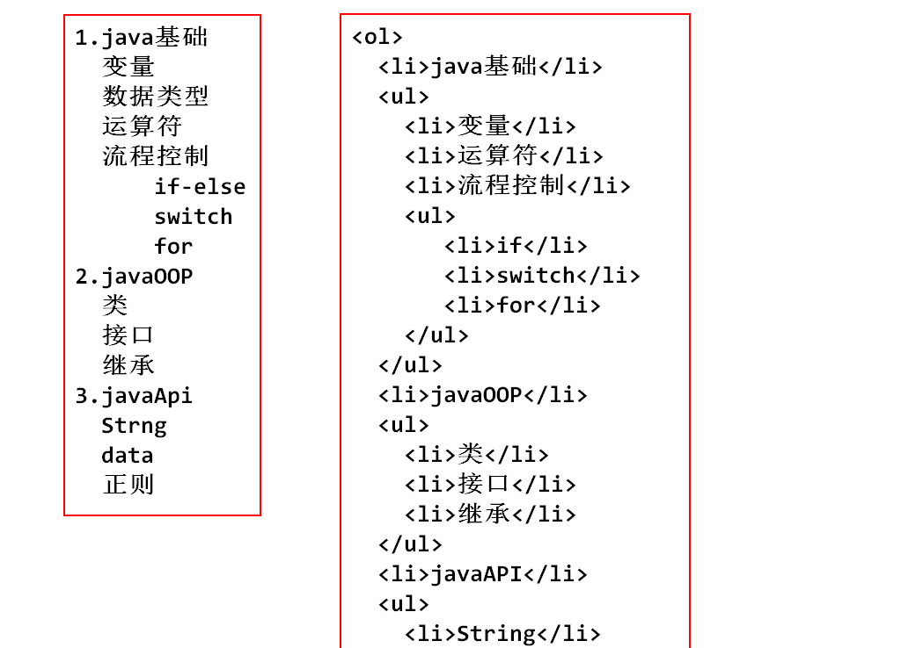
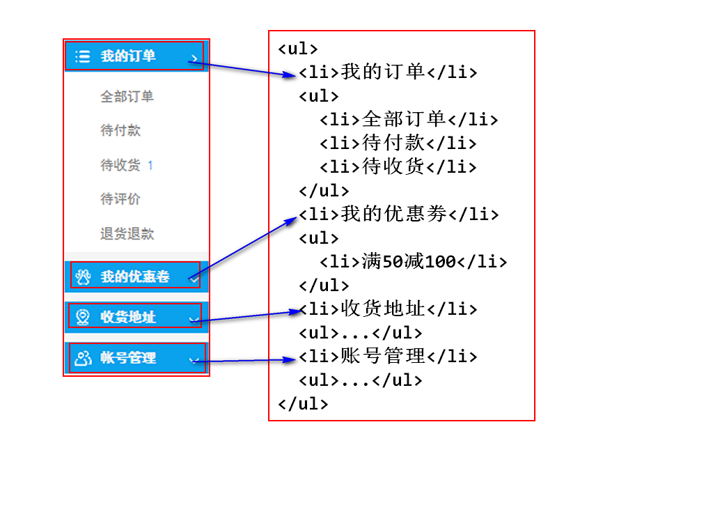

##  前端课程介绍
1. HTML -  用来勾勒出网页的结构和内容 - ->骨架。
2. CSS -【样式表】用来美化网页- ->皮肤、化妆、美颜、整容的效果。
3. JavaScript - 让网页呈现出动态的数据和效果。
4. JQuery - 是JS的框架，提高了JavaScript的开发效率。

##Java知识体系：


##  浏览器内核
1. Webkit(safari内核、Chrome内核原型)，开源的。
2. Mozilla(FireFox)火狐浏览器内核。
3. Opera 欧朋浏览器内核。
4. IE 微软官方IE内核。

## HTML
#### 1.HTML是什么?
->超文本标记语言


#### 注意：Html文件在哪里保存,Html文件在哪里运行？
1. html网页文档保存在服务器中。
2. 由浏览器下载html文档后，解析并且显示。

#### 2.HTML怎么用？
1.超文本标记语言： html.
2.就是标签相对固定的xml：
-  ->标签名固定.
-  ->标签上可以使用的属性固定.
-  ->标签与其他标签的嵌套固定.

>总结：我们学习html就是学习标签，学习标签属性，学习标签的嵌套关系。

#### HTML的最基本结构：
		<!DOCTYPE html>  <!-- html5标准 -->
		<html>    <!-- 根元素 -->
	  	<head></head>
	     <body>
	              <!-- body是在页面中显示的元素 -->
	     </body>
	  </html>

#### DOCTYPE：
1.文档类型的声明,告诉浏览器当前文档使用的html标准是什么版本,按照哪种版本的规则取解析显示。
2. <!DOCTYPE html> 是按照html5的规则去解析。
3. 如果不写DOCTYPE,不同浏览器解析标准不同。
4. 写了就没有差异了么？ NO、写了差异会很小，不写差异会很大！！！

#### HTML网页，在webserver中编写 


#### HTML文档的基本结构
1.title：建议设置。SEO:搜索引擎优化.
2.meta：设置浏览器端解码规则.


## HTML中常见标签

#### 1. 文本标签，跟论文格式很相似：

#### 标题： h1 h2 h3 h4 h5 h6 (hn)用于声明文章中的标题
#### 段落： p (paragraph)  前后都有回车符
#### 属性： align = "center'  设置文字句中显示

> 注意：所有的hn标签都可以使用align="center"属性使标题句中显示，但是现在的开发手段，一般是使用CSS进行格式化(居中、字体颜色、字号大小等等....)

#### 2.列表、显得有条理： u(unordered)  l(list)  - - ->ul
####  参数：            l(list)    i(item)  -  -  ->li
  - -> 无序列表---->u(unordered)  l(lists)  - - ->ul
```
 <ul>
    <li></li>
    <li></li>
</ul>
<ul>
    <li>飞机大战</li>
    <li>贪吃蛇</li>
    <li>飞翔的小鸟</li>
    <li>俄罗斯方块</li>
    <li>植物大战僵尸</li>
</ul>
```


  - -> 有序列表-----o(ordered) l(lists)- - ->ol
 ```
   < ol >
		<li> </li>
  </ ol >
 ```
### 有序列表无序列表的嵌套练习：

## 



## 分区:块分区
  *  < div >  </ div >:div默认是看不见的，它的存在时为了逻辑上的分区


#### 常用分区标签:
#### 都是H5新标签与div效果一样只是可读性高！！

	* header：定义 section 或 page 的页眉。
	* footer：定义 section 或 page 的页脚。
	* nav：定义导航链接。

#### 它们都属于块级分区，块级分区要独占一行。默认不允许其他元素在同一行！

### 行内分区：
```
  < span > </ span >
```

#### 行内分区，不会换行，会和其他文字混合显示在同一行上，如果只是一行文字内部的区域进行属性的设置，请使用行内分区.

## 元素的显示方式
1.块级元素：自己独占一行的元素:
   ```
-> hn：各级标题【h1 h2 h3 h4 h5 h6】
-> p ：一个段落
-> ol：有序列表
-> ul：无序列表
-> li：有序/无序列表内的子元素标签
-> header：定义文档或者文档的一部分区域的页眉
-> footer：定义文档或者文档的一部分区域的页脚
-> nav：定义导航链接的部分
-> div：定义一个区块
   ```

2.行内元素：可以与其他行内元素处于同一行。
 ```
-> span：定义行内分区
-> i  ->em：定义斜体
-> b  ->strong：定义粗体
-> u：下划线
-> del：删除线
 ```

#### 行内元素的空格折叠现象：写代码的时候，不管连续写了多少个空格、回车，都只会显示成一个空格
#### 解决方案：
实体引用：
```
->  & nbsp ;  写一次代表一个空格
->  < br > 写一次代表一个回车
->  & lt ;  代表 < 符号
->  & gt ;  代表 > 符号
```

### 图片标签
  	< img src = " " >

#### 网页中图片路径的写法：
1.绝对路径:从盘符（当前项目所在位置）开始的路径。
例如：c:/windows/system32/cmd.exe
- ->在tmooc,找到一个img标签，按F12，选中这个标签，在控制台右键点击标签路径选中open in new  tab在一个新选项卡中打开图片赋值这个新选项卡的地址栏，然后放入img的src中，就可以显示其他网站的图片了。这种行为称作图片的盗链。得到是绝对路径！

> 总结：一般情况下，在一个页面中显示其他网站的图片经常会使用绝对路径。

2.相对路径：从当前路径（项目所在路径）开始的路径。
例如: 要描述c:/windows/system32/cmd.exe。
只需要输入：  ./system.32/cmd.exe
- ->[.]表示当前路径
- ->[..]表示父目录

> 总结：在一个网站内，自己的图片资源一般使用相对路径。

## 关于img路径大总结：
```
1.使用其他网站的图片，一般使用绝对路径。
2.使用自己网站的图片资源，一般使用相对路径。
```

### img标签的常用属性：

      
      alt = ""    <!-- 图片加载失败时，显示的文本-->
      title = ""  <!-- 图片的描述文本-->
      width = ""  <!-- 设置图片宽-->
      height = "" <!-- 设置图片高-->
      >

> 注意：为了防止图片失真，一般宽和高只写一个，让另外一个属性去自适应。
* width 和 height,一般使用CSS去编写，不使用img的属性。

#### img标签支持的图片类型：
- jgp ：不支持透明色
- png ：支持透明色
- gif ：动图  256色