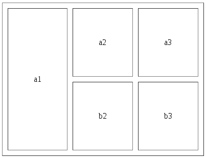

## 超链接：用于跳转页面
    <a> A标签内写内容用于跳转网页 </a> 
    <a href= "http://tmooc.cn/web/index_new.html?tedu">TMOOC</a>
	<a href= "../img/06.png"> >>>跳转到图片<<< </a>	 	
	<a href= "Demo02.html"> >>>跳转到本网站另一个页面<<< </a>

> 总结：a标签是行内元素，不换行。添加href属性，a标签才有效果！！href中的url也分相对路径和绝对路径。访问本网站的其他页面使用相对路径、访问其他网站使用绝对路径。

### a标签的其他属性：
	target = "_blank"  开启一个新窗口显示跳转页面.
    target = "_self"   默认当前窗口显示跳转页面.
    默认值是 _self、若有需求，则需要自行修改.

### 超链接   锚点的用法：
-  页面之间的跳转是超链接、那么一个页面内部的位置跳转是锚点。
   - H5的锚点设置方式：
	       <a href="#charAt">    charAt() 方法     </a>
           <h3 id = "charAt">    charAt() 方法详解  </h3>

   - H4的锚点设置方式：
	       <a href="#length">    length() 方法     </a>
           
		   <h3>length方法详解内容...................</h3>

>总结：H5与H4的区别在于H5直接通过索引凡是任何标签的id与href属性相同则跳转！而H4只能通过a标签的name属性索引跳转、并且它还是个空标签。

>> 刁钻面试题：java与javaSript有什么联系?
 * 它两没有任何关系！java与javaSript本质也不一样。java是面向对象语言、javaSript是脚本语言！

## 网页中的表格标签
  - 表格标签代码：一对tr标签代表一行；一对td标签代表一列。
	    <table  border="1px" align = "center" width="300px" height = "150px">

        	<tr> 第一行                    <!-- table row  tr代表行-->
            	<td> 第一列</td>		    <!-- table data td代表列-->
                <td> 第二列</td>
                <td> 第三列</td>
            </rt>

            <tr> 第二行
            	<td> 第一列</td>
                <td> 第二列</td>
                <td> 第三列</td>
            </rt>
        </table>

### 表格的相关属性：
 - border = "2px(像素)"
 - align  = "center(对齐代码)"
 - width  =  "设置宽"
 - height =  "设置高"
>这些属性一般写在样式中，目前只在学习和测试过程中使用、以后要往CSS样式里写！！！

### 重要属性：
1.单元格边框与内容的距离：
  - cellpadding = "(填写像素)"

2.单元格之间的距离：
  - cellspacing = "(填写像素)"

3.单元格的列合并：
  - colspan = "(占据的列数)"
>实例代码：
            <tr>
				<td colspan = "3">a1</td>
			</tr>
			<tr>
				<td>a2</td>
				<td>a2</td>
				<td>a2</td>
			</tr>
>实现效果：

4.单元格的行和并：
  - rowspan = "(占据的行数)"
>实例代码：
           <tr >
				<td rowspan="2">a1</td>
				<td>a2</td>
				<td>a3</td>
		   </tr>
		   <tr>
		   	<td>b2</td>
		   	<td>b3</td>
		   </tr>
>实现效果：

### 课堂练习：

### 表分组、跟分区类似：
	<thead> </thead>
    <tbody> </tbody>
    <tfoot> </tfoot>
##### 总结：逻辑分组，没有显示变化的表。一般用于表数据重构(表头表尾不动，只改中间内容)
##### th和td一样、但是th默认字体加粗且居中。【一般用于表头和表尾】

## 表单标签
 - 表单标签是用于在页面中显示一个可以收集用户填写的数据的控件.
 - 可以说，学习表单就是学习表单控件的结构和多种表单控件.

### form表单主要属性：
- action：表单提交url。（表单要提交什么，就填什么）.
- method：表单提交数据的方式get/post.

##### 所有的表单控件，都要在<form>标签的内部、for表单可以使用label。

### 文本输入框<text>/密码框<password>的主要属性：
- value：用户输入的任何文本都存在此参数中、可以设置默认值。
- maxlength：限制输入的字符数。
- readonly：设置只读、不可修改。但是数据可以提交。
- placeholder：文本提示。

>注意：文本输入框/密码框必须在form表单中，否则不具备提交数据功能。

### 单选框 redio：
	<input type="radio" name="gender" id="boy">
	<label for="boy">男</label>
	<input type="radio" name="gender" id="girl">
	<label for="girl">女</label>
	<input type="radio" name="gender" id="unknow"  checked="checked">
	<label for="unknow">保密</label>

>总结：name 属性、分组(同时保证可以提交)、属性checked,默认选中

### 多选框 checkbox：
	<input type="checkbox" name="hobby" value="study" id="xuexi">
	<label for="xuexi">学习</label>
	<input type="checkbox" name="hobby" value="sleep" id="shuijiao">
	<label for="shuijiao">睡觉</label>
	<input type="checkbox" name="hobby" value="swimming" id="youyong">
	<label for="youyong">游泳</label>
	<input type="checkbox" name="hobby" value="eat" id="chi">吃
	<label for="chi"></label>

### 按钮：
- submit：表单提交。
- button：普通按钮、调用javaScript代码。
- reset：重置按钮、清空表单数据。
		<input type="submit"  value="提交">
		<input type="button"  value="调用JS代码"'>
		<input type="reset"   value="重置">
> <input type="button" value="调用JS代码"  onclick="alert('此段后面部分为JS代码')">

### 隐藏域：
- 隐藏域的作用：不希望用户看到信息，同时有需要提交的时候上传。
       实例代码：<input type="hidden" name="cartud" value="1234">

### 文件选择框： file
- 上传单个文件。例如：上传头像
       实例代码：<input type="file" name="img">

- 上传多个文件：在后面加一个参数multiple.
       实例代码： <input type="file" name="img" multiple="multiple">

## 非input标签：
- 文本域，需要用户填写大量文本时使用：
      <form action="#">
	  	<label>请输入松货地址：</label>
	  	<textarea></textarea>
	  </form>
- 属性：rows和cols，原本的意思是每一行占多少个字符，能显示多少行字符。但是由于系统编码不同、浏览器解析不同，这个显示字符数差异很大.
- readonly：只读。

### 下拉选：
        <textarea rows="10" cols="20"></textarea>
	  	  <select name="tNname">
	    		<option>---请选择---</option>
		    	<option>---王克晶---</option>
		    	<option>---范传奇---</option>
	    		<option>---刘苍松---</option>
		    	<option>---李然---</option>
	        </select>
>总结：如果下拉选想要提交数据则需要name属性。
>1.value是选中的哪个option的内容。那么select的value就是选中的哪个option的内容。
>2.如果option设置了value属性，那么select的value就是选中的哪个option的value值。

      实例代码：<option value="0">---请选择---</option>
   			<option value="1">---王克晶---</option>
   			<option value="2">---范传奇---</option>
	   		<option value="3">---刘苍松---</option>
		   	<option value="4" selected="selected">---李然---</option>

## 关于form表单控件的大总结：
 *  1.只有含有name属性的表单控件才可以提交数据，提交的是value值。
 *  2.单选按钮和多选按钮必须设置value值，不然就算选中某一项，提交的也是"on"。
 *  3.关于表单控件的默认值设置：
 * 》》》3.1：文本框和密码框、设置value属性就可以显示默认文本。(提示文本placeholder)
 * 》》》3.2：单选框使用checked属性设置默认选中。
 * 》》》3.3：下拉选设置selected属性，默认选中
        实例代码： <option value="4" selected="selected">---李然---</option>

## CSS：层叠样式表
### CSS样式的编写使用方式：
- 内联样式：
	   <!--  内联样式 -->
	   <!--  在标签内部，用style属性添加样式 -->
	   <a href="#" style="color: red"> 五一节日快乐、就是不放学！！！</a>
>总结：除了学习和测试以外，内联样式不要使用。
	1.样式不能重用。
	2.内联样式的优先级最高,容易被覆盖。

### 内部样式：
 - 骨架：
       <ul>
		  <li>韭菜</li>
		  <li>菠菜</li>
		  <li>酸菜</li>
	   </ul>
 - 样式：
       

>总结：可以代码重用，但是开发用的少。因为它只能在本HTML页面被重用！！！

### 外部样式：
- 第一步：创建外部样式文件 style.css
- 第二步：在html中、head标签内部，引用外部的css文件：
      实例代码： <link rel="stylesheet" type="text/css"  href="style.css">

- 第三步：注意路径问题、注意rel属性必须写。

>总结：由于外部样式重用度高、所以开发中尽量使用外部样式。

## 样式表的优先级问题

- 1.浏览器默认样式- - ->优先级最低<绝对的>
- 2.内部样式和外部样式- - ->优先级<就近原则、离标签近就引用谁>
- 3.内联样式- - ->优先级最高<绝对的>