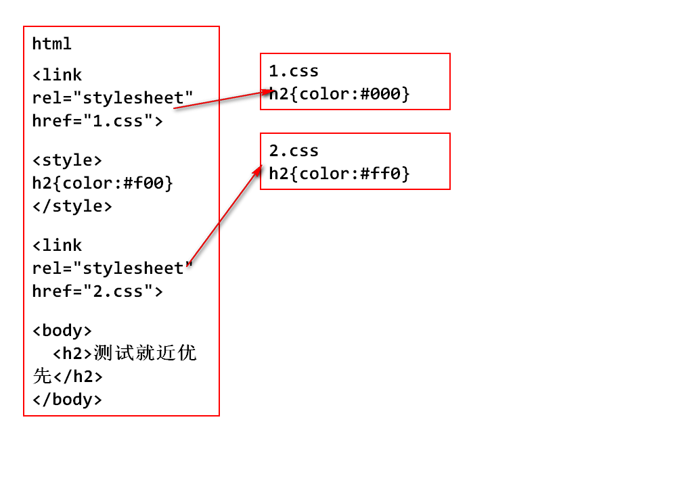
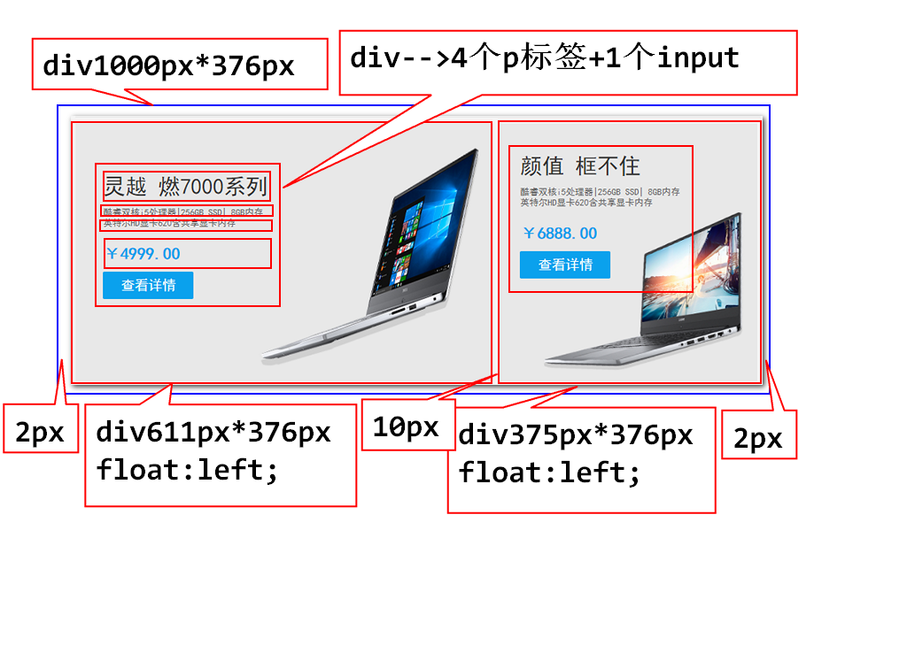

## CSS选择器

#### 选择器的作用、就是为了选出当前页面中符合要求的一个或者多个标签。

1. 标签选择器:
       h2{ color:#f00}
       p{}
       a{}
       input{}

2. id选择器- - ->由于一个html中、id都是唯一的，所以id选择器的作用码是选取当前页面中符合要求的一个标签。**【注意重点：一个】**
>       <h3 id="h"> id选择器</h3>
>       #h{color:#f00;}


3. 类选择器(class选择器)

	    <h2 class="w300">类选择器</h2>
       .w300{width:300;}

       .col{ color:#006699;}
	   .w100{
			border:1px solid red;
			width:100px
		}
        <h2 class="col w100"> 类选择器 </h2>
		<p class="col w100">类选择器</p>
		<span class="col">类选择器</span>

4. 派生选择器：可以通过父标签找到符合要求的子孙标签。
         <style type="text/css">
			ul li span a{ color:#f00; }
			ul li .gz{ color:#7C001f; }
			ul li a{ color:#0f0; }
			ul a{ color:#0f0; }    子孙标签都算
	    </style>
		  <body>
			<ul>
				<li><a href="#">北京</a></li>
				<li><a href="#">上海</a></li>
				<li><a href="#" class="gz">广州</a></li>
				<li><span><a href="#">深圳</a></span></li>
			</ul>
 	    </body>

5. 子类选择器：根据父标签、找到符合要求的子标签。
 		ul>a{ color:#0f0; }    子类选择器：只针对儿子下手
  		<a href="#">佳木斯儿</a>

6. 伪类选择器：在一系列动作中，添加某种样式。
>  :hover- -鼠标悬停和鼠标离开
>      <a class = "gz">....</a>
		<div id="d1"> 伪类选择器的演示 </div>

> 总结：选择器（派生/子类）写的越具体、优先级越高。【当选择器一致时、就进原则】

## CSS常用样式属性
- 布局相关：单位：px / 100%
     width:设置宽
     height:设置高
     margin:设置外边距
>       margin:10px;同时控制4个外边距的距离。
>       margin:10px  20px;意味着上下为10px，左右为20px.
>       margin:0px auto;块级标记的水平居中
>       margin:10px  20px  30px  40px; 分别代表上右下左。
>---
>       margin-top:设置上外边距。
>       margin-right:设置右边距。
>       marginbottom:设置下边距。
>       margin-left:设置左边距。

     padding:设置内边距
>		padding:10px;  同时控制4个方线的内边距。
>		padding:10px 20px;  意味着上下10px,左右20px.
>		padding:10px 20px 30px 40px; 分别代表上右下左。
>---
>	    padding-top：设置上内边距
>	    padding-right：设置右内边距
>	    padding-bottom：设置下内边距
>	    padding-left：设置左内边距

- 总结1：一个div如过不设置宽度则默认占父容器宽度的100%。
- 总结2：一个div如果不设置高度则默认高度为0px。如果有内容，那么内容多高，div就撑起多高。
- 总结3：盒子模型、元素之间的留白，元素背景的填充范围，元素的大小，这些东西的控制规定方在一其，就是和子模型。盒子模型一般用于集选整体布局的宽度。
> - 一个元素占用页面的宽度计算公式为：
> - 左外边距+左边框+左内边距+内容取与宽度+右内边距+右边框+右外边距

- 背景相关属性(background)：
> - background-color：背景颜色
> - background-image：背景图片
> - background-repeat：背景图片的平铺方式
> - background-position：背景图片的位置
> - background-size：背景图片的大小
> - - -
> - - background - color:背景颜色：
> - - 颜色值可以如下设置：
```
       1.纯英文单词，类似于red、green等...
       2.#ffffff 6位16进制字符串。例如：#006699
       3.#f00 相当于 #ff0000
       4.RGB(255,255,255)。0-ff == 0-255
       5.RGBa(255，255，255，0-1)：a是阿尔法、透明度的意思；数值1不透明、0.5半透明、0全透明。
```
> - - -
> - - **background-image:背景图片：**
> - - div设置了背景图片，那么div内部的元素将会在背景图片之上显示。
> - - -
> - - **background-repeat：背景图片的平铺方式 :**
```
       1.background-repeat:no-repeat; (不平铺)
       2.background-repeat:repeat; (平铺)
       3.background-repeat:repeat-x; (横向平铺)
       4.background-repeat:repeat-y; (纵向平铺)
```
> - - -
> - -**background-position：背景图片的位置 :**
> - - center / top / bottom / left / right / 具体数值
```
     background-position : x轴 y轴;
     backgrund-position:right bottom;
     backgrund-position:270px 20px;
     backgrund-position:center center;
```
> - -**background-size：背景图片的大小 :**
```
        background-size:330px 350px;
```

### 课堂练习：
     <style type="text/css">

    #d0{
        width: 1000px;
        height: 376px;
        margin: 0px auto;
    }
    #d1{
        width: 611px;
        height: 376px;
        background-color: #e8e8e8;
        background-image: url("../images/itemCat/study_computer_img1.png");
        background-repeat: no-repeat;
        background-position: 270px 20px;
        background-size:330px 350px; 
        margin-left: 2px;
        margin-right: 10px;
        float: left;/* 左浮动,为了让块级元素在一行显示 */
    }
    #d3{
        width: 375px;
        height: 376px;
        float: left;
        background-color: #e8e8e8;
        background-image: url("../images/itemCat/study_computer_img2.png");
        background-repeat: no-repeat;
        background-position: 84px 112px;
        background-size:296px 232px;
        margin-right: 2px;
    }
    #d2{
        width: 245px;
        height: 232px;
        margin-top: 68px;
        margin-left: 36px;
        padding: 5px;
    }
    .p1{
        color: #333;/* 字体颜色 */
        font-size: 32px;/* 字号大小 */
        font-weight: lighter;/* 字体权重(粗细) */
        margin-bottom: 12px;
        font-family: "黑体";/* 字体种类 */
    }
    .p2{
        color: #666;
        font-family: "黑体";
        font-size: 12px;
        font-weight: lighter;
        margin-bottom: 1px;
        margin-top: 0px;
    }
    .p3{
        margin-bottom: 12px;
        color: #0aa1ed;
        font-size: 24px;
        font-weight: bold;
    }
    input{
        width: 132px;
        height: 40px;
        font-size: 20px;
        color: #fff;
        background-color: #0aa1ed;
        font-family: "黑体";
    }
    #d1:hover{
        background-size:400px 410px;
        background-position: 250px 0px;
    }
    </style>
        <body>
        <div id="d0">
            <div id="d1">
                <div id="d2">
                    <p class="p1">灵越 燃7000系列</p>
                    <p class="p2">酷睿双核i5处理器|256GB SSD| 8GB内存</p>
                    <p class="p2">英特尔HD显卡620含共享显卡内存</p>
                    <p class="p3">￥4999.00</p>
                    <input type="button" value="查看详情">
                </div>
            </div>
            <div id="d3">
                <div id="d2">
                    <p class="p1">颜值 框不住</p>
                    <p class="p2">酷睿双核i5处理器|256GB SSD| 8GB内存</p>
                    <p class="p2">英特尔HD显卡620含共享显卡内存</p>
                    <p class="p3">￥6888.00</p>
                    <input type="button" value="查看详情">
                </div>
            </div>
        </div>
    </body>



- 字体相关：
- 文本属性：
- 边框属性：
- 常见复杂属性：