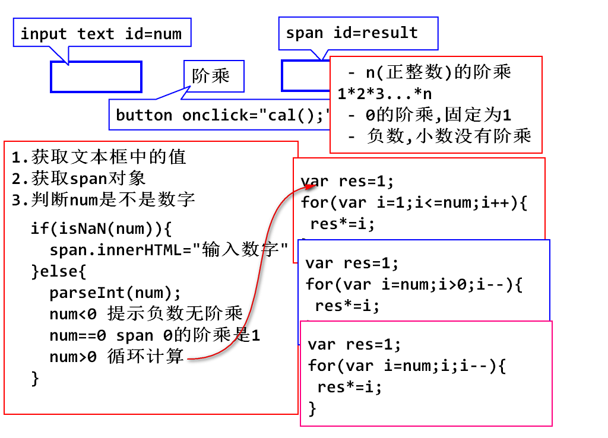
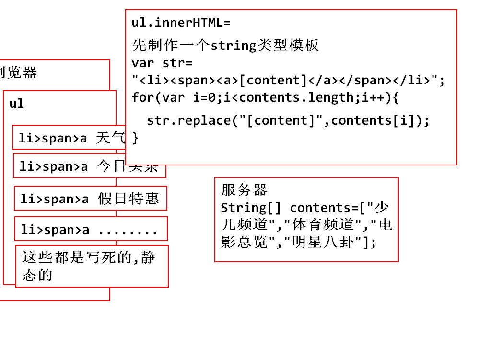
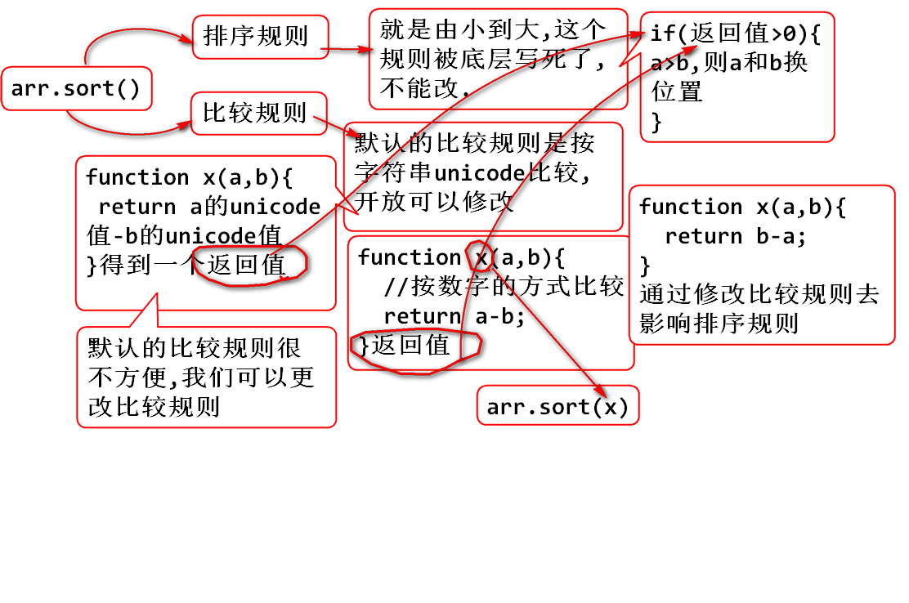

## 循环：for / while / do while
- 代码实例练习：
		<title>阶乘的练习</title>
		<script type="text/javascript">
		function cal(){
			var input = document.getElementById("num");
			var num = input.value;
			var span = document.getElementById("result");
			if(isNaN(num)){
				span.innerHTML="请输入合法的数字！！！";
			}else{
				num = parseInt(num);
				input.value=num;
				if(num<0){
					span.innerHTML="负数没有阶乘";
				}else if(num==0){
					span.innerHTML="0的阶乘为1";
				}else{
					var res=1;
					for(var i=num;i;i--){
						res*=i;
					}
					span.innerHTML=res;
					}
				}
			}
		</script>
		</head>
		<body>
			<input type="text" id="num">
			<input type="button" value="阶乘" onclick="cal();">
			结果为:<span id="result"></span>
		</body>


## JacaScript常用API
- String 对象：
  1.创建对象的两种方式：
      	var str1 = "Hello World"; 
		var str2 = new String("Hello World");
  2.String字符串大小写转换：
		str.toLowerCase();
		str.toUpperCase();
  3.获取指定的字符(串)：
		str.charAt(index);

		var str="javaScript网页教程";
		var str1=str.charAt(12);  //教
  4.查询指定的字符串：
		str.indexOf("");	 //从前往后找
		str.lastIndexOf(""); //从后往前找

		var str="javaScript网页教程";
		var index=str.indexOf("a");  //1		
		str.lastIndexOf("a");  //3  
  5.截取子字符串：
		str.substring(star,[end]);   []意味着这个里面的参数是可以省略的。
		
		var str = "abcdefghijklmnopqrstuvwxyz";
		var str1 = str.substring(2);	  //"cdefghijklmnopqrstuvwxyz"
		var str2 = str.substring(2,4);	  //"cd"  含头不含尾;
  6.替换子字符串：
		str.replace(str1,str2);
		str1 - - >要找到的字符串;
		str2 - - >新的字符串;
		返回值是替换后的新字符串。
		
		var str="abcde";
        var str1=str.replace("cd","aaaa");   //"abaaaae"
  7.拆分子字符串：
		str.split(str1,[length]);
		str1 - ->表示分割用的子字符串；
		length - ->表示指定返回数组的最大长度(可省略);
		返回值为分割之后的字符串数组。
		
		var str1 = "123#456#789";
		var strArray1 = str1.split("#");    // ["123", "456", "789"]
		var str2 = "一,二,三,四,五,六,日"
		var strArray2 = str2.split(",",5);	// ["一", "二", "三", "四", "五"]

### 课堂练习

	<ul id="ul">
	</ul>

	<script type="text/javascript">
	 	var oUl=document.getElementById("ul");
		//假设从服务器获取了一组数据
		var contents=["天气预报","奇人异事","法制社会","寻人启事","明星趣事"];
		//制作一个string的模板,使用[content]占位
		var str="<li><span><a>[content]</a></span></li>";
		for(var i=0;i<contents.length;i++){
			//替换模板中的[content]
			oUl.innerHTML+=str.replace("[content]",contents[i]);
		}
			
		//console.log(oUl.innerHTML); 
	</script>


### Number对象的常用方法：
- toFixed(length):将Number转换为字符串，保留小数点一定的位数.如果必要，该数字会被四舍五入、也可以用0补足位数。（补得太多会导致精度丢失。）

### 数组
- js中的数组特点：
1.Array在js中都是object类型的数组，可以同时存任意数据类型的值。
		var arr=["打一顿","不多于",12.3,true];
		typeof(arr);     //object

		var arr1 = new Array();
		arr1[0]="123";
		arr1.push(23);  
2.数组长度可变，且有两种创建方式，不管哪一种创建出来，都是Object类型。

- 数组的API：
		arr.reverse();     //反转输出。
		arr.sort()         //比较排序
> sort方法，是按照数组中，每一个元素的unicode编码进行排序的，比完第一位比第二位。
> string就是这样排序,但是这种排序不适用于number 
>		var arr = [5,12,3,14,26,1];
>		console.log(arr.sort());  
>		输出结果为：[1, 12, 14, 26, 3, 5]
>		
>		var arr = ["a","ac","ab","d","db","b","bd","c","cd","cb"];
>		console.log(arr.sort());  
>		输出结果为：["a", "ab", "ac", "b", "bd", "c", "cb", "cd", "d", "db"]

		var arr = [5,12,3,14,26,1];
	
		//修改比较规则：按照数字大小比较。(只适合数字比较)
		console.log(arr.sort(function(a,b){
		return a-b;
		}));   //不需要再次使用，用匿名函数的写法



### math:四舍五入：
- Math.round(x)	 把数四舍五入为最接近的整数。
- Math.floor(4.5);  正数往小的舍， 负数往比它更小的入。

### date：有关于时间的api;
> date的API：是从服务器拿到时间对象，在页面根据不同的需求显示。

- 创建客户机当前时间：
		var d1 = new Date();

- 创建指定时间的date对象(指定时间一般源于服务器)：
		var date = new Date("2016/12/12 12:12:12");

- 读写时间的毫秒数：
		getTime() ：读时间
		setTime() ：写时间

- 读时间的年月日：
		d1.getUTCFullYear();   //获取年份
		d1.getMonth();         //获取月份,因为从0开始，需要+1处理。
		d1.getDate();		   //获取本月的第几天
		d1.getDay();		   //获取本周的第几天

		d1.getHours();		   //获取当前时间的小时
		d1.getMinutes();	   //获取当前时间的多少分钟
		d1.getSeconds();       //获取当前时间的多少秒

- date转化成本地时间格式：
		d1.toString();
		d1.toLocaleTimeString();    将时间转为本地当日的 时：分：秒 格式
		d1.toLocaleDateString();    将时间转为本地当日的 年/月/日 格式

## 正则表达式的一些字符：
^ 表示输入字符串开始匹配的位置
- 例如：  ^xxxxxx

$ 表示输入字符串结束匹配的位置	  
- 例如：^xxxxxxx$

* 表示匹配前面的子表达式零次或多次
- 例如：  [a-z]*

. 表示任意字符
- 例如： .+  表达任意字符出现一次或多次

`+` 表示前面的字符出现一次或多次

？表示前面的字符或线零次或一次
- 例如： (\\+86)?

{n}  表示匹配确定n次。
- 例如： 规定了z必须出现3次   z{3}    abcdwezzzsdd则算通过

{n,} 表示至少匹配n次
- 例如： 规定了a必须至少2次   a{2,}   sdcxaasdsda

{n,m}表示少匹配n次，最多不超过m次

		[abc]   a、b、c中任意一个字符
		[^abc]  除了a、b、c的任意字符
		[a-z]	  a.b.c.d.....z的任意小写英文	
		[A-Z]	  A.B.C.D....Z的任意大写英文
		[a-zA-Z0-9]   ==     \w

- [^0-9]      非数字     ==    \D  非数字
- [ 0-9]	  0.1.2.3.4.....9的任意数字   ==   \d  任意数字

		\s  空白字符，相当于[\t\n\xOB\f\r]
		\W  非单词字符
		\S  非空白字符


* 分组 "( )"
```
分组： ( )圆括号表示分组，可以将一系列正则表达式看作一个整体。分组时可以使用“|”表示“或”的关系。
例如：匹配手机号码前面的区号：
(\+86|0086)?\s?\d{11}
上述例子中，圆括号表示这里需要出现"+86"或者"0086"
```

### 正则：
- 如何创建正则对象：
  1.直接创建的方式创建：
		var reg=/正则表达式/[模式]
		var reg=/no/;

  2.创建对象的方式创建：
		var reg = new RegExp(正则表达式,[模式]);
		var reg = new RegExp(`\\s\\d`);   //此句有坑,需要考虑转义问题。

- 正则的几种模式：
  1.全局模式：设定当前匹配为全局; g

  2.当前模式：设定当前匹配模式忽略大小写; i

- 正则对象的方法：
- - reg.exec(str);

		<title>正则的演示</title>
		<script type="text/javascript">
			var str="you can you up,no can no BB";
			var reg=/no/g;

			//从str中找到匹配正则的子串。普通模式下，返回第一个符合要求的子串。
			//全局模式下，第n此执行，返回符合要求的第n个字符串。
			console.log(reg.exec(str));	   //"no", index: 15
			console.log(reg.exec(str));	   //"no", index: 22
			console.log(reg.exec(str));	   //null
			console.log(reg.exec(str));	   //"no", index: 15
		</script>

- - reg.test(str); 判断str中是否包含reg匹配的子串。
		var str=" 1";
		var reg = new RegExp("\\s\\d");  //用创建对象来匹配字符串，需要考虑转义问题。
		console.log(reg.test(str));

- 字符串匹配正则的方法： str.xxx(reg);
- - 关键字屏蔽：将str中的与re g匹配的所有子串都替换成目标字符串。
		str.replace(reg,"");
		
		var str="you can you up,no can no BB";
		var reg=/no/g;
		var s = str.replace(reg,"*");
		console.log(s);
		输出结果为 ：you can you up,* can * BB

- - 截取找到的指定子串：从str中找出和reg匹配的子串、返回的值是数组。
		str.match(reg); 

		var str="you can you up,no can no BB";
		var reg=/no/g;
		console.log(str.match(reg));
		输出结果为 ： ["no", "no"]

- - 查找字符串位置索引位置：从str中找出和reg匹配的第一个子串的索引。(类似于indexOf())
		str.search(reg)

		var str="you can you up,no can no BB";
		var reg=/no/g;
		console.log(str.search(reg));
		输出结果为 ： 15

## onblur事件会在对象失去焦点时发生：
例如把光标定位在一个文本框里，然后当光标移除文本框并点击其他地方，就发生了一个onblur事件，相应的函数（方法）就会触发。

## onclick事件会在对象被点击时发生：
例如设置一个按钮，当你点击这个按钮时，相应的函数（方法）就会触发。