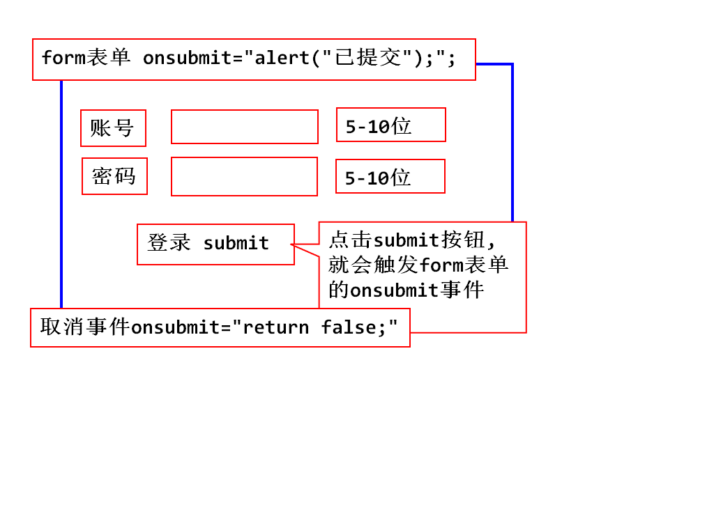
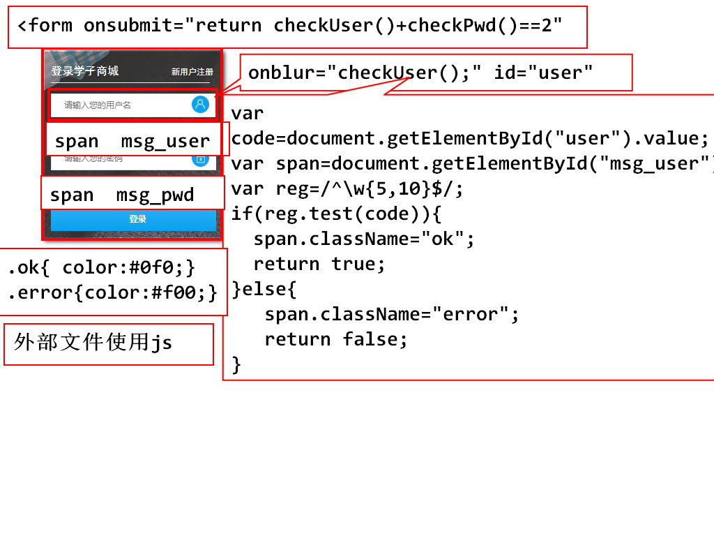
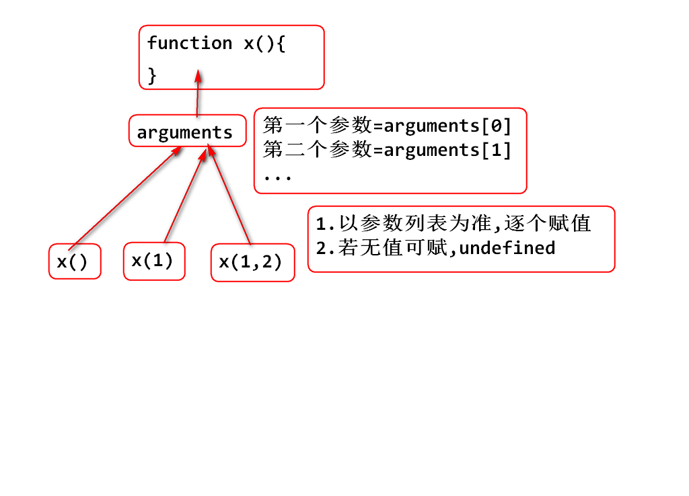
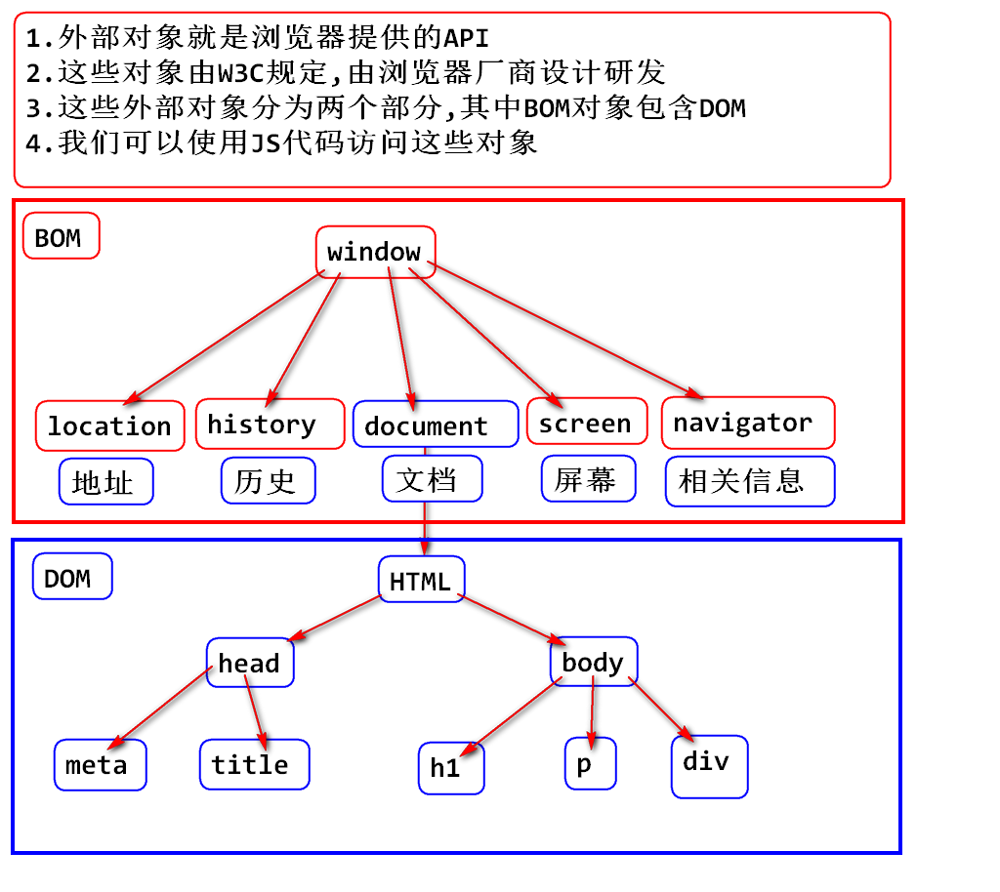
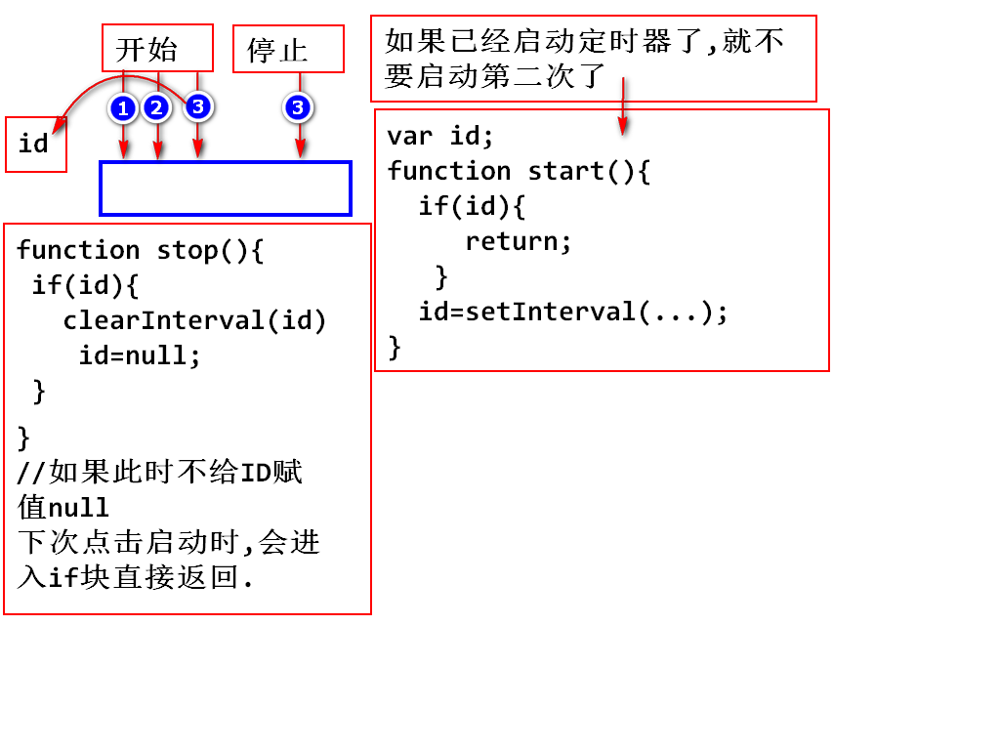
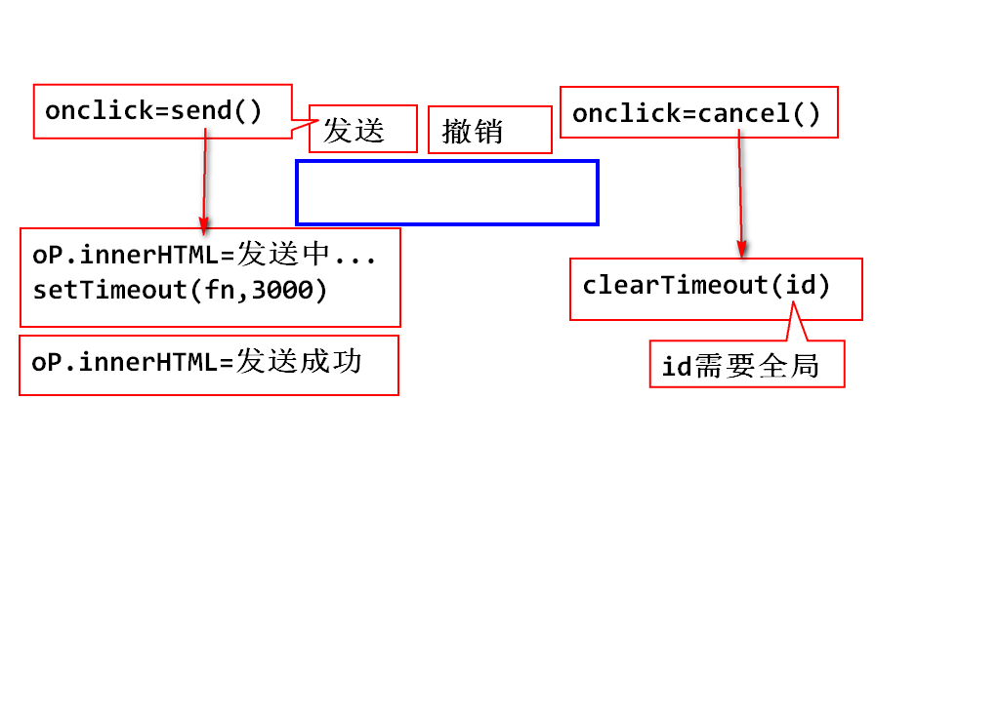

## 完善form表单的验证：

		<body>
			<form action="http://www.tmooc.cn"   
			onsubmit="return checkUser()*checkPwd()==1;">
				

					账号:<input type="text" id="username" 
					onblur="checkUser();">
					5-10位数字,字母,下划线
				

				

					密码:<input type="password" id="pwd" 
					onblur="checkPwd();">
					5-10位数字,字母,下划线
				

				

					<input type="submit" value="登录">
				

			</form>
		</body>

		

		

- 学子商城登陆页表单验证

## function对象：
- 1.js中函数就是function对象
- 2.函数名就是指向function对象的引用
		var fn1 = function(){}
		function fn1(){}         效果同上一样
- 3.使用函数名可以直接访问函数对象
- 4.函数名后面跟上()，是调用函数
		var fn1 = function(){alert("我被猪点了");}

		fn1；          //返回：ƒ (){alert("我被猪点了");}
		fn1()；        //返回：alert事件，出现弹框。
- 5.函数的返回值：
   5.1 不定义返回值的类型
   5.2 默认返回值是undefined
   5.3 可以使用return返回具体的值

- 6.函数的参数：
		function x(a,b){
			return a-b;
		}

### js的函数没有重载
- 函数被调用时，只要函数名一样，无论传入多少个参数，调用的都是同一个函数对象，所以js没重载。但是可以实现和重载一样的调用方式，使用arguments.

- 传来的参数，系统会自动生成一个arguments数组，我们只要遍历这个数组，就能拿到传入的值。
		function add(){
			var num = 0;
			for(var i=0;i<arguments.length;i++){
				num+=arguments[i];
			}
			return num;
		}
		该实例代码能实现传入的参数进行累加。

- js在调用函数的过程中，只检测函数名，不检测参数列表。如果参数名称匹配，则直接调用，可以使用arguments访问传递过来的参数列表。

- js中没有重载，如果出现相同函数名的两个函数，后一个有效。因为代码由上往下执行，后写的函数覆盖了前一个函数。
 
### 匿名函数
- 所谓匿名函数，就是不给函数起名字。
- 用法：当一个函数不需要在别的地方被调用，则可以使用匿名函数。

### 全局函数
- 全局函数可用于所有的JavaScript对象。
- 它不需要对象调用。
		常用全局函数： typeOf();
					 isNaN();
					 parseInt();
					 parseFloat();
					 eval(); 
- arguments：
 

#### eval(); 
- 功能一：eval函数用于计算表达式字符串。

		var str = "1+2+3";
		eval(str);
		输出：6 
- 功能二：eval函数用于**执行**字符串中的js代码。
- 
		var str = "alert('eval能直接执行代码')";
		var str = "function a(){alert('eval能直接执行代码');}a();"
		eval(str);   
		输出效果：弹窗出现eval能直接执行代码.
> eval重要的作用就是动态执行服务器传过来的JavaScript代码。

		function cal(){
		var input = document.getElementById("num");
		var num = input.value;
		//开始计算：
		try{
		input.value=eval("("+num+")"); 
		//使用eval进行计算的时候，最好在数字两边加括号，以免出现BUG
		}catch(e){
			input.value="error";
		}
	  }

## 外部对象概述：
### BOM与DOM：

- BOM (Browser Object Model):浏览器对象模型
- DOM (Document Object Model):文档对象模型

> BOM总结：通过BOM，我们可以移动窗口、更改状态栏文本、执行其他不与页面内容发生直接联系的操作(不操作标签)。
> BOM是没有标准的，每个浏览器标准都不一样、但是却被浏览器厂商广泛支持。

>---

> DOM总结：DOM定义了访问和操作HTML的标准方法，通过对DOM树的操作，来实现对HTML文档数据的操作。

## JS相关BOM操作：
### window对象：表示整个浏览器窗口
- 所有js的全局对象、全局函数以及全局变量，都自动成为window对象的成员(window可以直接点出来)
- window的常用属性：
		document  窗口中显示的HTML文档对象
		history   浏览过的历史记录对象
		location  窗口文件地址对象
		screen    当前屏幕对象
		navigator 浏览器相关信息对象

- window对象常用的函数：
  1.弹出框：

		function fn1(){
			window.alert("你好:我是普通弹出框");
		}
		<input type="button" value="按钮1" onclick="fn1();">

  2.确认框：

		function fn2(){
			var flag =window.confirm("Hellow:我是确认框");	
			console.log(flag);
		}
		<input type="button" value="按钮2" onclick="fn2();">

  3.输入框：

		function fn3(){
			var str = window.prompt("中午吃了什么？");
			console.log(str);
		}
		<input type="button" value="按钮3" onclick="fn3();">

## 定时器：
### 主要用于网页动态时钟、倒计时、轮播图、无缝滚动、跑马灯效果。

- 周期性定时器：以一定的时间间隔执行代码，循环往复。

		setInterval(exp,time);			/*开始定时器*/
		exp:要执行js语句（一般为匿名函数）
		time:设定时间周期(单位为毫秒)
		返回值：返回已经启动的定时器ID

		clearInterval(ID);				/*关闭定时器*/
		ID:填入开启定时器返回的ID

  实例代码：
		function fn4(){	//每一秒打印一个数-->5、4、3、2、1
		var num = 5;
		var id = setInterval(function(){
			console.log(num--);
			if(!num){
				clearInterval(id);
			}
		},1000);
		console.log("Boom Boom Boom");
	  }
> 总结：启动定时器就相当于启动了一个子线程，当前方法fn4相当于主线程。两个线程之间并发执行，相互不等待。

### 课堂练习：网页版电子时钟：

>		<title>时钟小Demo</title>
		

		
- 一次性定时器(延迟执行)：在一个设定好的时间间隔之后来执行代码。 
		setTimeout(exp,time);
		exp:执行的代码
		time:需要延迟的时间
		返回值为:id

		clearTimeout(id);

> 发送撤销的案例：

		
		
		</head>
		<body>
			

				<input type="button" value="发送" 
				onclick="send();">
				<input type="button" value="撤销" 
				onclick="cancel();">
			

			

		</body>