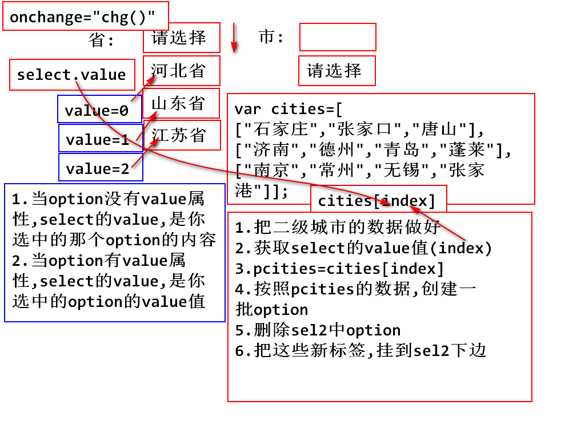
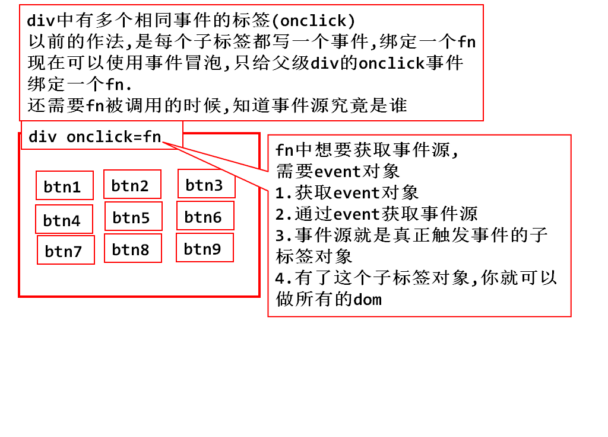
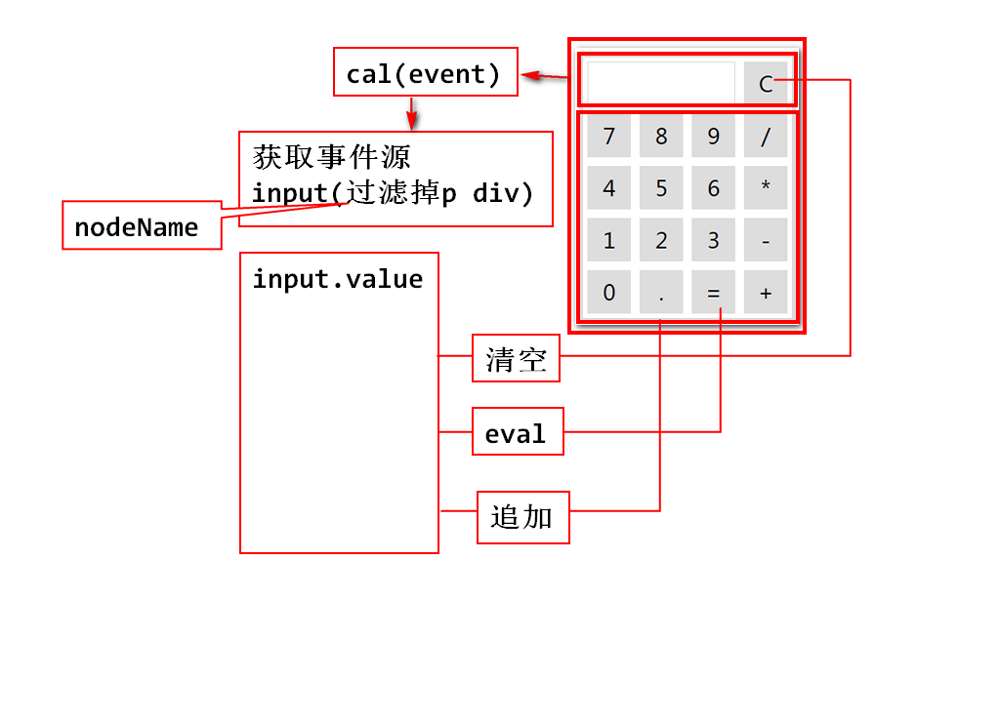

### 二级联动：

		
		<body>
			省:
			<select onchange="chg();" id="province">
				<option value="-1">请选择</option>
				<option value="0">河北省</option>
				<option value="1">山东省</option>
				<option value="2">江苏省</option>
			</select>
			市:
			<select id="city">
				<option>请选择</option>
			</select>
		</body>

## JavaScript事件处理
### 事件：指页面元素状态的改变，用户在操作鼠标或者键盘时触发的动作.
一、鼠标事件：

	->  onclick     ：鼠标单击
	->  ondblclick  ：双击 
	->  onmouseover ：悬停
	->  onmouseout  ：离开
	->  onmousedown ：按下
	->  onmouseup   ：抬起

二、键盘事件：
		
	->  onkeydown   ：按下键位
	->  onkeyup     ：抬起

三、状态改变事件：

	 ->  onload      ：页面加载后执行
	 ->  onchange    ：框内容改变时、也可用于单选框与复选框改变后触发的事件。
	 ->  onfocus     ：焦点获取
	 ->  onblur      ：失去焦点
	 ->  onsubmit    ：提交一个表单

四、事件绑定：
  - 在标签属性中，直接处理事件：
			<input type="button" value="按钮1" onclick="fn1();">

  - 在js代码中动态定义，可以吧html代码和js代码分离，便于维护！
		window.onload=function(){
			var input=document
			.getElementsByTagName("input")[0];
			
			input.onclick=fn2;
		}
		function fn2(){
			console.log("动态定义事件绑定");
		}

  - 取消事件：  onXXX = "return false";
  
  - 事件处理机制：--->冒泡事件:
  
		<title>事件冒泡的演示</title>
		</head>
		<body>
			

			  

				input(btn)-->p-->div <input type="button" value="事件冒泡的演示"
					onclick="alert('input');">
			  

			

		</body>

> 总结：如果点击input，将会一次触发input->p->div的onclick事件，这种现象称为事件冒泡.
> 发生事件冒泡的要求：
> 1.嵌套关系；
> 2.内层和外层标签必须是同一个事件；例如都是onclick事件，或者都是onchange事件。
> 3.若中间一层与冒泡事件不同，则会被跳过;

  - 取消事件的冒泡：由于浏览器厂商使用的内核不同，有两种方法取消:
		 1.event.stopPropagation();
		   >以前只支持火狐(firefox)、chrome.现在高版本的id已经支持了，ie8.0及其以下不支持
		   
		 2.event.cancelBubble = true;
		   >以前只支持ie、现在在高版本firefox、chrome中已经支持了。

		实例代码：
			

				input(btn)-->p-->div 
			<input type="button" value="事件冒泡的演示"
				onclick="event.cancelBubble=true;alert('input')">
			

## event对象，事件对象(很重要)： 
### 获取event对象：
- 任何事件触发后，都会产生一个event对象
- event对象记录事件发生时的鼠标位置、键盘按键状态和触发对象（事件源）...等等的一些信息。

  1. 在Html属性中直接使用event对象.

		 <input type="button" value="HTML_for_IE_FF_Chrome" onclick="alert(event.clientX+':'+event.clientY);">
		 //获取鼠标点击按钮时的X轴       鼠标的Y轴
  >虽然支持IE/FF/Chrome，但是这种写法，是没有意义的.我们希望Html代码和Js代码分离(松耦合)
  
  2. 在Js代码块中，直接使用event对象.
  		
		  
		  <input type="button" value="js_for_chrome_IE" onclick="fn1();">
  > IE浏览器和Chrome,Chrome对IE做了兼容。

  3. 在函数中使用event对象，必须以传参的方式.
  
		  function fn2(event){
			 alert(event.clientX+':'+event.clientY);
		  }
		  <input type="button" value="for_FF_IE_Chrome" onclick="fn2(event);">
  > 这种方式：FF/IE/Chrome都支持，所以开发中要求这种写法最为合适。

### 计算机案例：
 

	JS代码逻辑分析：
	     1. 获取事件源;
	     2. 过滤掉P和DIV;
	     3. 得到input的value;
	     4. 得到P对象；
	         a. 清空               xx.innerHTML="";
			 b. 计算完毕在P里显示   
			 c. 追加在P里显示

### 关于this的使用：
		<title>关于this</title>
		
		</head>
		<body>
			

			 <input type="button" value="1.今天除了皮啥都没干" onclick="cal(this);">
			 <input type="button" value="2.今天皮了一下很舒服" onclick="cal(this);">
			 <input type="button" value="3.皮皮虾我们走不回头" onclick="cal(this);">
			 <input type="button" value="4.李时珍的香蕉很瓜皮" onclick="cal(this);">
           

		</body>
