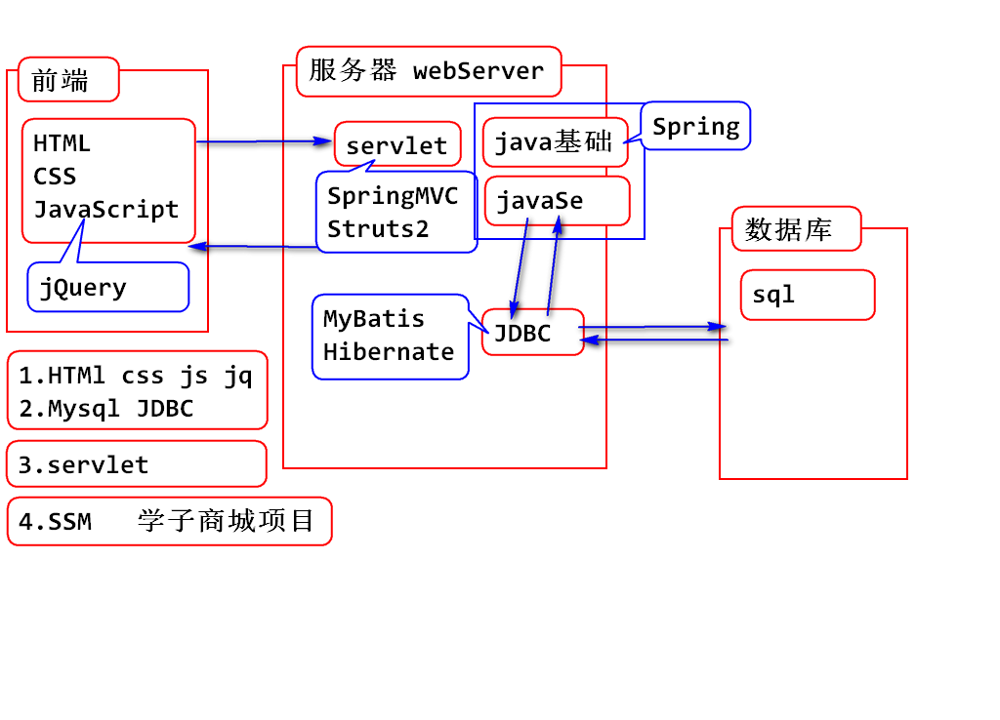
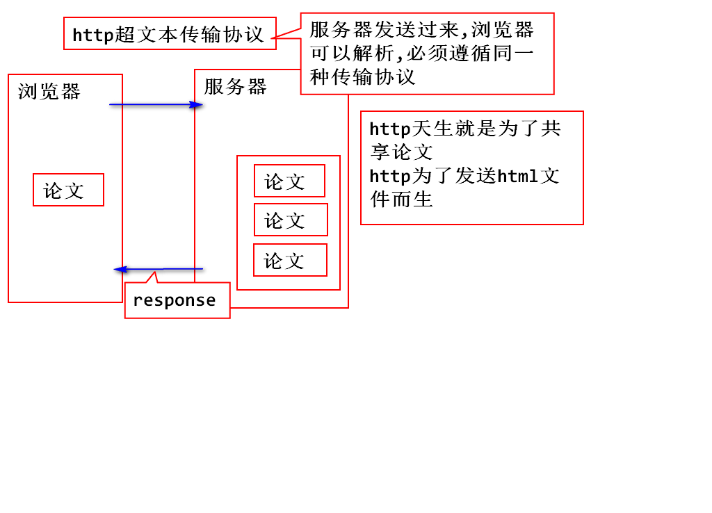
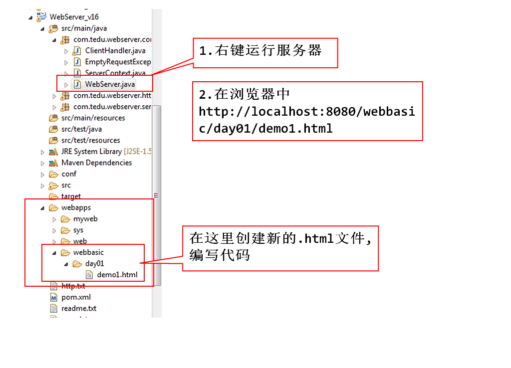
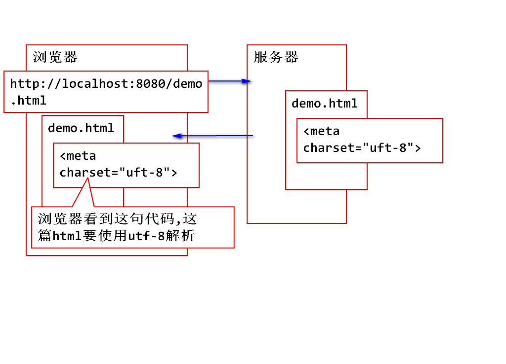
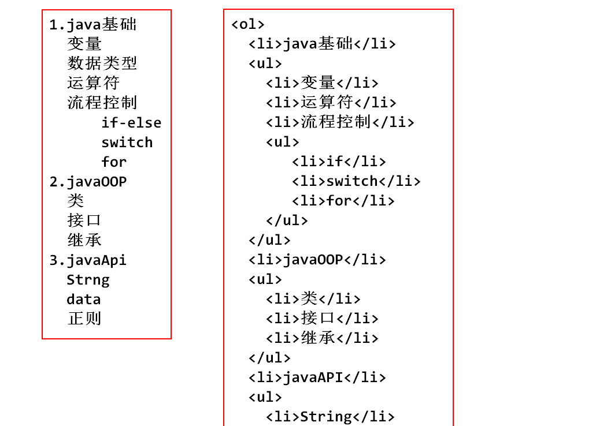
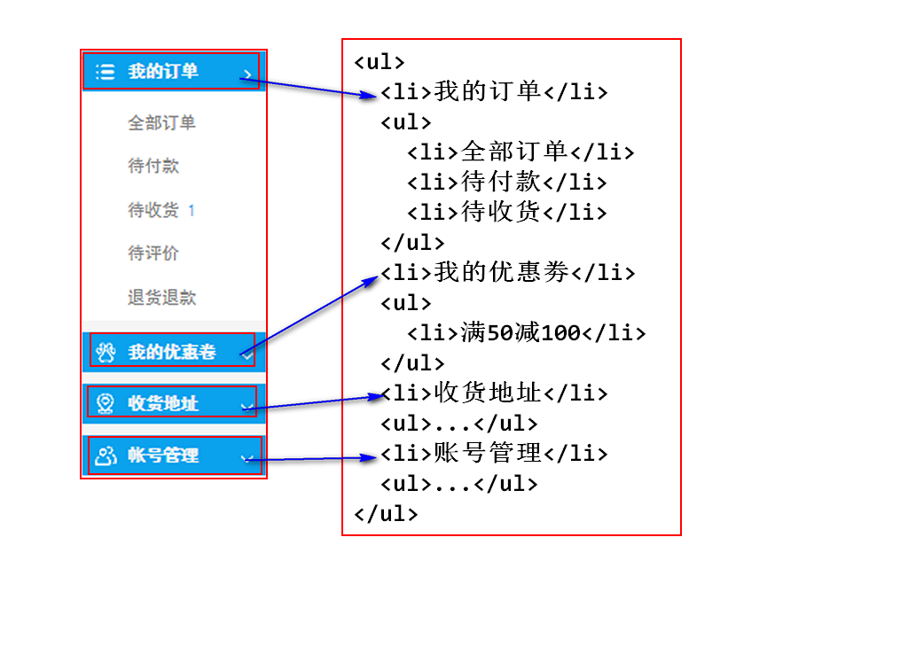
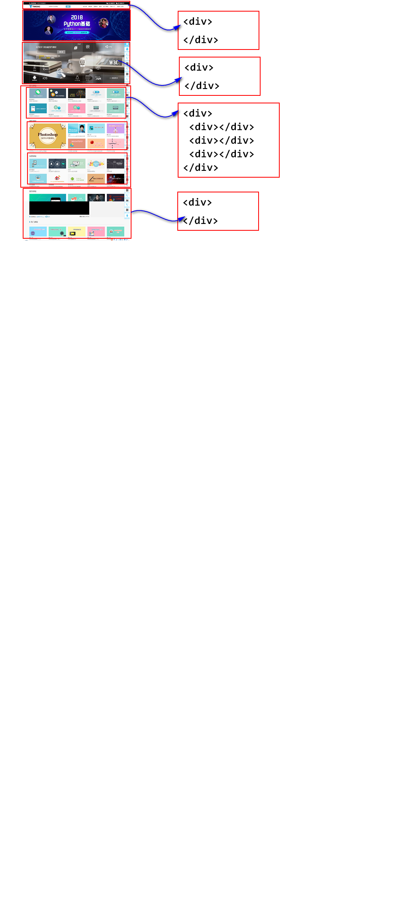

# day01
## 李然 g-liran@tedu.cn

### markdown  windows---markdownpad2

## java知识体系

## 前端课程介绍

1. HTML-用来勾勒出网页的结构和内容--骨架(1.5天)

2. CSS-样式表-用来美化网页-(皮肤-化妆-美颜-整容)(2.5天)

3. javaScript-让网页呈现出动态的数据和效果 (5天)

4. jQuery-是js的框架,提高了javascript的开发效率 (2-3天)

### 浏览器内核

1. webkit(safari内核,Chrome内核原型),开源的

2. Mozilla(FireFox)

3. Opera 欧鹏

4. IE

## HTML

### 1.HTML是什么

### 注意:html文件在哪里保存,html文件在哪里运行

1. html网页文档保存在服务器中

2. 由浏览器下载html文档后,解析并且显示

### 2.HTML怎么用

1. 超文本标记语言    

2. 就是标签相对固定的xml

	2.1 标签名固定

	2.2 标签上可以使用的属性固定

	2.3 标签与其他标签的嵌套固定

### 总结:我们学习html,就是学习标签,学习标签属性,学习标签的嵌套关系

### HTML的最基本结构
		
		<!DOCTYPE html>
		<html><!--根元素-->
			<head></head>
			<body>
				<!--在页面中显示的元素-->
			</body>
		</html>

### DOCTYPE

1. 文档类型的声明,告诉浏览器当前文档使用的html标准是什么版本,按照哪种版本的规则去解析显示

2. `<!DOCTYPE html>` 是按照html5的规则去解析

3. 如果不写DOCTYPE,不同浏览器解析标准不同

4. 写了就没有差异了么?不是的,差异会很小

## HTML网页,在webserver中编写

### HTML文档的基本结构

		<!-- 文档类型声明 -->
		<!-- 告诉浏览器当前文档使用html标准是HTML5 -->
		<!DOCTYPE html>
		<html>
		<!-- head描述当前页面的基本信息 -->
		<head>
		<!-- 设置浏览器端解码规则 -->
		<meta charset="UTF-8">
		<!-- 定义当前页面的标题 -->
		<title>我的第一个网页</title>
		</head>
		<!-- body用于定义页面中含有的控件(标签) -->
		<body>
			helloworld
		</body>
		</html>

1. title,建议设置,SEO:搜索引擎优化

2. meta 设置浏览器端解码规则

## HTML中常见标签

### 1. 文本标签,跟论文格式很相似
### 标题  h1 h2 h3 h4 h5 h6  (hn) 用于声明文章中的标题

### 2. 段落 p paragraph 前后是有回车

### 3. 属性align="center"

### 注意:所有的hn标签都可以使用align="center"属性
### 使标题居中显示
###	但是现在的开发手段,一般是使用css进行格式化(居中,字体颜色,字号大小等等)
### 所以在标签内部写属性,控制样式的方式,用的少啦

## 上午小作业
1. 创建homework1.html
2. 在开启webserver后通过域名访问

### 课堂练习,模拟写自己的简历

### 列表,显得有条理

1. 无序列表 u-unordered l-list--->ul
			l-list   i-item--->li

		<ul>
			<li></li>
			<li></li>
		</ul>

		<ul>
			<li>飞机大战</li>
			<li>贪吃蛇</li>
			<li>飞翔的小鸟</li>
			<li>俄罗斯方块</li>
			<li>植物大战僵尸</li>
		</ul>

2. 有序列表

		<ol>
			<li></li>
		</ol>

### 有序列表无序列表的嵌套练习

### 无序列表的嵌套练习

## 分区

### 块级分区

		

### div默认是看不到的,它的存在是为了逻辑上做分区

### header footer nav 的作用和div一模一样.只是可读性提高了,是H5新标签.可以和div标签嵌套使用

### 它们都属于块级分区,块级分区要独占一行.默认不允许其他元素在同一行

### 行内分区,不会换行,会和其他文字混合显示在同一行上
### 如果只是一行文字内部的区域进行属性的设置,请使用行内分区

		

## 元素的显示方式

1. 块级元素,自己独占一行的元素

		hn p ul ol li header footer nav div

2. 行内元素,可以和其他行内元素处于同一行

		span  行内分区

		<i></i>/<em></em>   定义斜体
		<b></b>/<strong></strong> 定义粗体
		<u></u>  下划线
		<del></del>  删除线

### 行内元素的空格折叠现象
### 写代码的时候,不管连写多少个空格,回车,都会显示成一个空格
### 实体引用

		&nbsp; 代表一个空格
		    代表一个回车

### 图片标签

		

### 网页中图片路径的写法

1. 绝对路径

	 	在tmooc,找到一个img标签,
		按F12,选中这个标签
		在控制台右键点击标签路径
		选中open in new tab
		在一个新选项卡中打卡图片
		复制这个新选项卡的地址栏
		然后,放入img的src中.就可以显示其他网站的图片了
		这种行为称作图片的盗链
		得到的是绝对路径

### 总结,一般情况下,在一个页面中显示其他网站的图片
### 经常会使用绝对路径,链接显示图片
### 行业中,称专门提供网页图片的网站为图床

2. 相对路径

		

### 总结:在一个网站内,自己的图片资源一般使用相对路径

## 关于img路径大总结:
### 1. 使用其他网站的图片,一般使用绝对路径
### 2. 使用自己网站的图片资源,一般使用相对路径

### img标签的常用属性

		

### 为了防止图片失真,一般 宽和高只写一个.让另外一个属性去自适应
### width和height,一般使用css去编写,不使用img的属性了
### img标签支持的图片类型

	1. jpg  不支持透明色
	2. png  支持透明色
	3. gif  动态图  256色

## 作业

1. 笔记和demo要过一遍
2. 写一份模拟的简历
3. 预习明天的PPT

	

