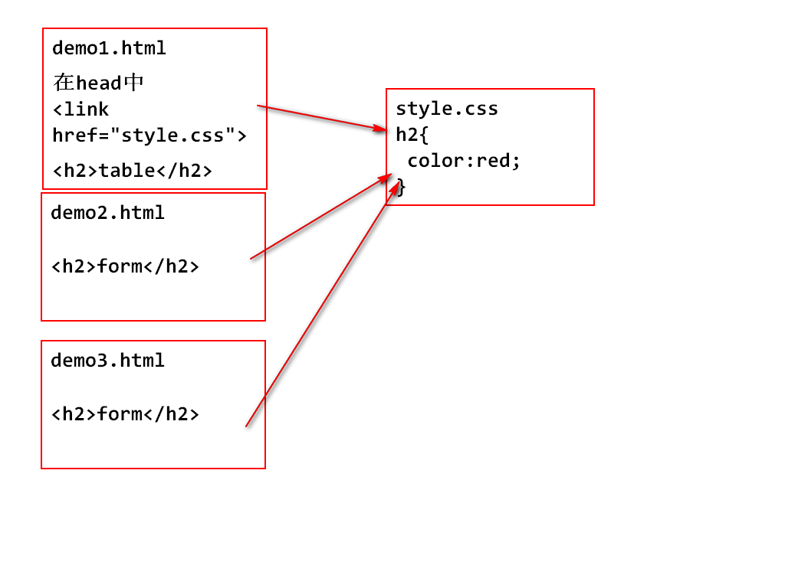

#day02

## 复习
### HTML
### 文本标签
### 分区
### 元素的显示模式--****
### img

## 超链接 用于跳转页面

		<a>范传奇</a>

		<a href="http://www.tmooc.cn">TMOOC</a>
		<a href="../img/06.png">跳转到图片</a>
		<a href="demo2.html">跳转本网站的另一个页面</a>

### 总结:a标签是行内元素
### 添加href属性,a标签才有效果
### href中的url也分相对路径和绝对路径
### 访问本网站的其他页面使用相对路径
### 访问其他网站,使用绝对路径

### a标签的其他属性

		target="_blank" 新页面,开启一个新窗口显示
		target="_self"  新页面,在原窗口显示
		默认是_self

### 超链接 锚点的用法
### 页面之间的跳转,是超链接
### 一个页面内部的位置跳转是锚点

		-- H5的锚点设置方式
		<a href="#charAt">charAt 方法</a>
		<h3 id="charAt">charAt 方法</h3>

		-- H4的锚点设置方式
		<a href="#length">length 方法</a>
		

## 网页中的表格标签

		<table>
			<tr><!-- table row -->
				<td></td><!-- table data -->
				<td></td>
				<td></td>
			</tr>
			<tr>
				<td></td>
				<td></td>
				<td></td>
			</tr>
		</table>

### 表格的相关属性

	border="2px" 
	align="center" 
	width="200px" 
	height="100px"

> 这些属性一般写在样式中,目前只在学习和测试过程中使用

### 重要属性

1. 单元格边框与内容的距离

		cellpadding=""

2. 单元格之间的距离
	
		cellspacing=""

### 列合并和行合并

		colspan="占据的列数"
		rowspan="占据的行数"

---

		<table border="2px" 
				 align="center" 
				 width="300px" 
				 height="300px"
				 cellpadding="50px"
				 cellspacing="10px">
			<tr>
				<td colspan="3">111</td>
			</tr>
			<tr>
				<td>111</td>
				<td>222</td>
				<td>333</td>
			</tr>
		</table>
		<table border="1px">
			<tr>
				<td rowspan="2">aaa</td>
				<td>aaa</td>
				<td>aaa</td>
			</tr>
			<tr>
				<td>aaa</td>
				<td>aaa</td>
			</tr>
		</table>

### 课堂练习

### 表分组,跟分区类似

		<thead></thead>
		<tbody></tbody>
		<tfoot></tfoot>

---

	<h1>一周早餐食谱和预算</h1>
	<table border="1px;">
		<thead>
			<tr>
				<th>周一</th>
				<th>周二</th>
				<th>周三</th>
				<th>周四</th>
				<th>周五</th>
			</tr>
		</thead>
		<tbody>
			<tr>
				<td>包子</td>
				<td>煎饼</td>
				<td>粥和油条</td>
				<td>鸡蛋灌饼</td>
				<td>星巴克</td>
			</tr>
		</tbody>
		<tfoot>
			<tr>
				<th>10元</th>
				<th>8元</th>
				<th>12元</th>
				<th>6元</th>
				<th>15元</th>
			</tr>
		</tfoot>
	</table>

### 总结:逻辑分组,没有显示变化
### 一般用于表数据重构
### th和td一样,但是th默认字体加粗,居中

## 表单标签

### 表单标签是用于在页面中显示一个可以收集用户填写的数据的控件.
### 学习表单,就是学习表单控件的结构和多种表单控件

		<form action="url" method="get">
		
			<h3>登录学子商城</h3>
			

				<label>请输入用户名:</label>
				<input type="text" name="username">
			

			
			

				<label>请输入密码:</label>
				<input type="password" name="pwd">
			

			

				<input id="auto" type="checkbox" name="auto">
				<label for="auto">自动登录</label>
			

			

				<input type="submit" value="登录">
			

		
		
		</form>

## form表单主要属性
### action 表单提交url
### method 表单提交数据的方式get/post
### 所有的表单控件,都要在`<form>`标签的内部
### form表单,可以使用label

### 文本输入框/密码框 的主要属性

### value 用户自用输入的任何文本
### maxlength 限制输入的字符数
### readonly  设置只读,不能修改,但是数据可以提交
### placeholder 文本提示

### 单选框和多选框
### 单选框 radio

		<input type="radio" name="gender" id="m">
		<label for="m">男</label>
		<input type="radio" name="gender" id="f">
		<label for="f">女</label>
		<input type="radio" name="gender" 
		id="unknow" checked="checked">
		<label for="unknow">保密</label>

### 总结:name 属性,分组(同时保证可以提交)
### 属性checked,默认选中

### 多选框 checkbox

	<h3>演示多选框</h3>
	<form action="#">
		<input id="study" type="checkbox" name="hobby" value="study">
		<label for="study">学习</label>
		<input id="sleep" type="checkbox" name="hobby" value="sleep">
		<label for="sleep">睡觉</label>
		<input id="teacherC" type="checkbox" name="hobby" value="teacherC">
		<label for="teacherC">刘苍松老师</label>
		<input id="swimming" type="checkbox" name="hobby" value="swimming">
		<label for="swimming">游泳</label>
		<input type="submit" value="提交">
	</form>

### 按钮

		submit 表单提交
		button 普通按钮,调用javaScript代码
		reset  重置按钮,清空表单内容

### 隐藏域
### 不希望用户看到的信息,同时又需要提交的时候上传

	<input type="hidden" name="cartid" value="1234">

### 文件选择框 file
### 上传文件用的,比如上传头像

		<input type="file" name="img" multiple="multiple">

### multiple="multiple" 多重的,可以同时选择多个文件

### 非input标签

1. 文本域,需要用户填写大量文本时使用

		<form action="#">
			<label>请输入送货地址</label>
			<textarea></textarea>
		</form>

		属性:rows和cols,原本的意思是每一行占多少个字符,能显示多少行字符.
		但是由于系统编码不同,浏览器解析不同,这个显示字符数差异很大.
		readonly,只读

### 下拉选

		<select name="tName">
			<option>--请选择--</option>
			<option>王克晶</option>
			<option>范传奇</option>
			<option>李然</option>
			<option>刘苍松</option>
		</select>

### 总结,如果下拉选想要提交数据,需要name属性

	1. 如果option没有设置value属性,那么select的value就是选中的那个option的内容

	2. 如果option设置了value属性,那么select的value就是选中的那个option的value

## 关于form表单控件的总结

	1. 只有含有name属性的表单控件才可以提交数据,提交的是value值
	2. 单选按钮和多选按钮,需要设置value值,不然就算选中,提交的数据也是"on"
	3. 关于表单控件的默认值设置

		3.1 文本框和密码框,设置value属性就可以显示默认文本.(提示文本placeholder)
		3.2 单选框使用checked属性设置默认选中
		3.3 下拉选设置selected属性,默认选中

## CSS 层叠样式表

### CSS样式的编写使用方式

### 1. 内联样式

	<!-- 内联样式 -->
	<!-- 在标签内部,用style属性添加样式 -->
	<a href="#" style="color: red">五一节日快乐,就是不放学</a>

### 总结:除了学习和测试以外,内联样式不要使用
	
	1. 样式不能重用
	2. 内联样式的优先级最高

### 2.内部样式

		<ul>
			<li>韭菜</li>
			<li>菠菜</li>
			<li>酸菜</li>
		</ul>

		

### 总结:可以代码重用,但是开发用的少
### 只能在本html页面被重用

### 3.外部样式

	1. 创建外部样式文件 style.css
	2. 在html中,head标签内部,引用外部的css文件

		<link rel="stylesheet" type="text/css" href="style.css">

	3. 注意路径问题,注意rel属性必须写.

### 总结:由于外部样式,重用度高,所以开发中尽量使用外部样式.

## 作业
1. 课程表

2. 混乱的注册页面

 