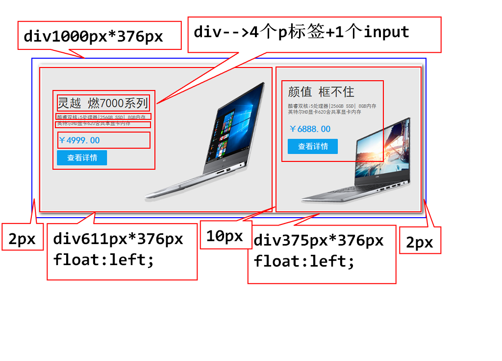
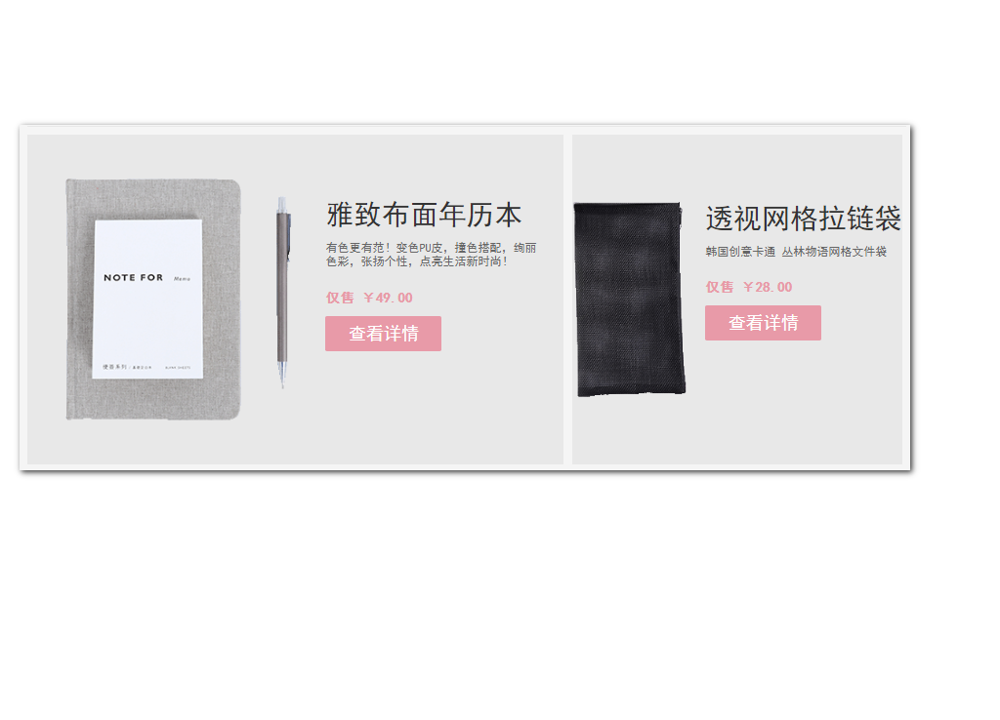

#day03

## 复习

### css层叠样式表

### 1.内联样式--display:none/block;
### 2.内部样式--学习的时候使用
### 3.外部样式--开发中一定使用外部样式

## 样式表的优先级问题

### 1.浏览器默认样式-优先级最低
### 2.内部样式和外部样式-就近优先

### 3.内联样式-优先级最高

## css选择器
### 选择器的作用,就是为了选出当前页面中符合要求的一个或者多个标签

1. 标签选择器,一般用于定义默认样式,等待被其他样式覆盖

		h2{color:#f00}
		p {}
		a {}
		input {}

2. id选择器-由于一个html中,id都是唯一的,所以id选择器的作用,是选取当前页面中符合要求的**一个**标签

		<h3 id="h">id选择器</h3>

		#h {color:#f00;}

3. 类选择器(class选择器)

		<h2 class="w300">类选择器</h2>

		.w300{width:300px;}

		<h2 class="col w100">类选择器</h2>
		
类选择器

		类选择器

		.col{ color: #006699;}
		.w100{ 
			border: 1px solid red;
			width: 100px;
		}

4. 派生选择器-可以通过父标签找到符合要求的子孙标签

		<body>
			<ul>
				<li><a href="#">北京</a></li>
				<li><a href="#">上海</a></li>
				<li><a href="#" class="gz">广州</a></li>
				<li><a href="#">深圳</a></li>
				<a href="#">佳木斯儿</a>
			</ul>
			<a class="gz">....</a>
		</body>

		/*ul li span a{
			color: #f00;
		}
		ul li .gz{
			color: #f00;
		} */
		ul a{
			color: #990066;
		} 

5. 子类选择器-根据父标签,找到符合要求的子标签

		ul>a{}

		ul>a{
			color: #990066;
		}

6. 伪类选择器 -在一系列动作中,添加某种样式 

	:hover--鼠标悬停和鼠标离开

### 总结:选择器(派生,子类)写的越具体,优先级越高.

		<body>
			<ul>
				<li><a href="#">北京</a></li>
				<li><a href="#">上海</a></li>
				<li><a href="#" class="gz">广州</a></li>
				<li><a href="#">深圳</a></li>
				<a href="#">佳木斯儿</a>
			</ul>
			<a class="gz">....</a>
			
			
伪类选择器的演示

		</body>

		

## CSS常用样式属性

1. 布局相关属性

		width:      单位:px   100%
		height:

		margin:设置外边距

		margin:10px;同时控制4个外边距的距离
		margin:10px 20px;上下为10px,左右为20px;
		margin:0px auto;块级标记的水平居中写法

		margin:10px 20px 30px 40px;上右下左

		margin-top:上外边距
		margin-right:右外边距
		margin-bottom:下外边距
		margin-left:左外边距

		padding:设置内边距
		padding:10px;4个方向都是10px
		padding:10px 20px; 上下10,左右20px
		padding:10px 20px 30px 40px;上右下左

		padding-top:上内边距
		padding-right:右内边距
		padding-bottom:下内边距
		padding-left:左内边距

### 总结1:一个div如果不设置宽度,默认占父容器宽度的100%
### 总结2:一个div如果不设置高度,默认高度为0px.如果有内容,那么内容多高,div就撑起多高

### 总结3:盒子模型,元素之间的留白,元素背景的填充范围,元素的大小,这些东西的控制规定放在一起,就是盒子模型
### 盒子模型一般用于计算整体布局的宽度

### 一个元素占用页面的宽度计算公式为
### 左外边距+左边框+左内边距+内容区域宽度+右内边距+右边框+右外边距

   

2. 背景相关属性(background)

	background-color:背景颜色
	background-image:背景图片
	background-repeat:背景图片的平铺方式
	background-position:背景图片的位置
	background-size:背景图片的大小

####　background-color:背景颜色
#### 颜色的值可以如下设置
		
		1.纯英文单词,类似于red,green等
		2.#ffffff 6位16进制字符串
		3.#f00 相当于 # ff 00 00
		4.rgb(255,255,255); 
		5.rgba(255,255,255,0~1) 1不透明,0全透明

#### background-image:背景图片

#### div设置了背景图片,那么div内部的元素将会在背景图片之上显示(背景图片类似于桌布)

#### background-repeat:背景图片的平铺方式

	1. background-repeat:no-repeat; 不平铺
	2. background-repeat:repeat; 平铺
	3. background-repeat:repeat-x;横向平铺
	4. background-repeat:repeat-y;纵向平铺

#### background-position: 背景图片的位置

#### center|top|bottom|left|right|具体数值

#### background-position: x轴 y轴;

		background-position: right bottom;
		background-position: 270px 20px;
		background-position: center center;

####　background-size:宽 高;设置背景图片的大小

		background-size:330px 350px;

### 课堂练习

		<body>
			

				

					

						
灵越 燃7000系列

						
酷睿双核i5处理器|256GB SSD| 8GB内存

						
英特尔HD显卡620含共享显卡内存

						
￥4999.00

						<input type="button" value="查看详情">
					

				

				

					

						
颜值 框不住

						
酷睿双核i5处理器|256GB SSD| 8GB内存

						
英特尔HD显卡620含共享显卡内存

						
￥6888.00

						<input type="button" value="查看详情">
					

				

			

		</body>
		
		

## 作业:

1. 笔记中所有的知识点和demo,都重新敲一遍
2. 完成如下demo

3. 字体相关属性
4. 文本属性
5. 边框属性
6. 常见复杂属性

