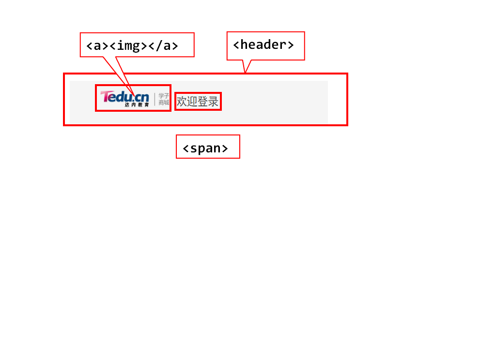
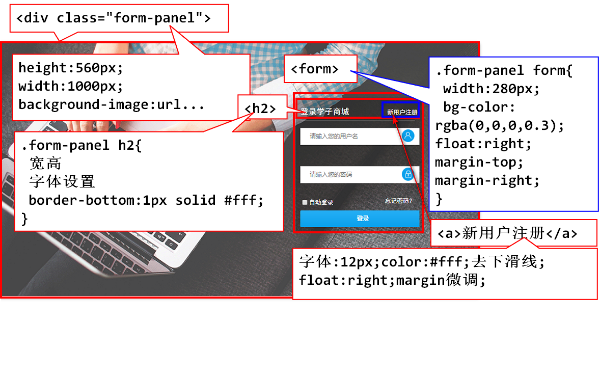
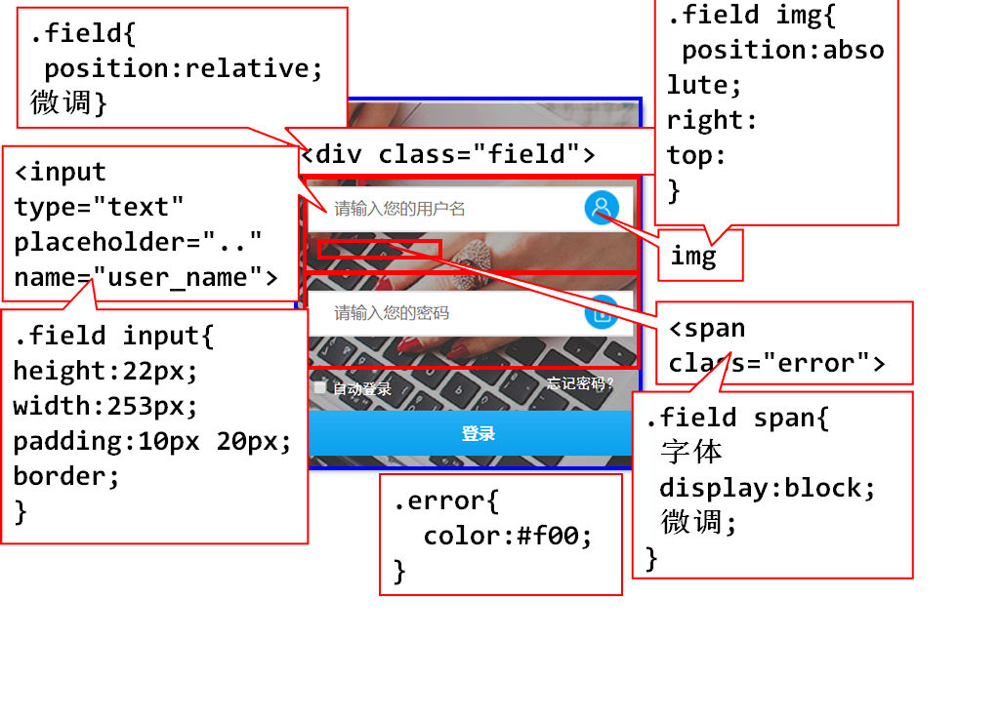
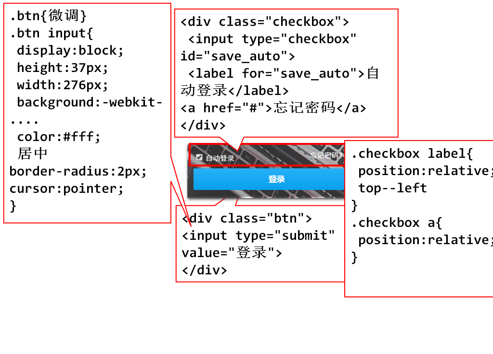
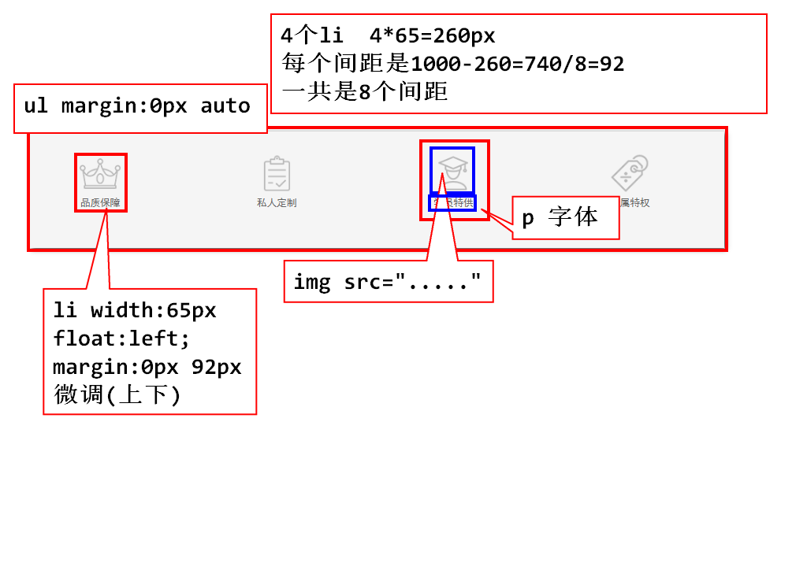
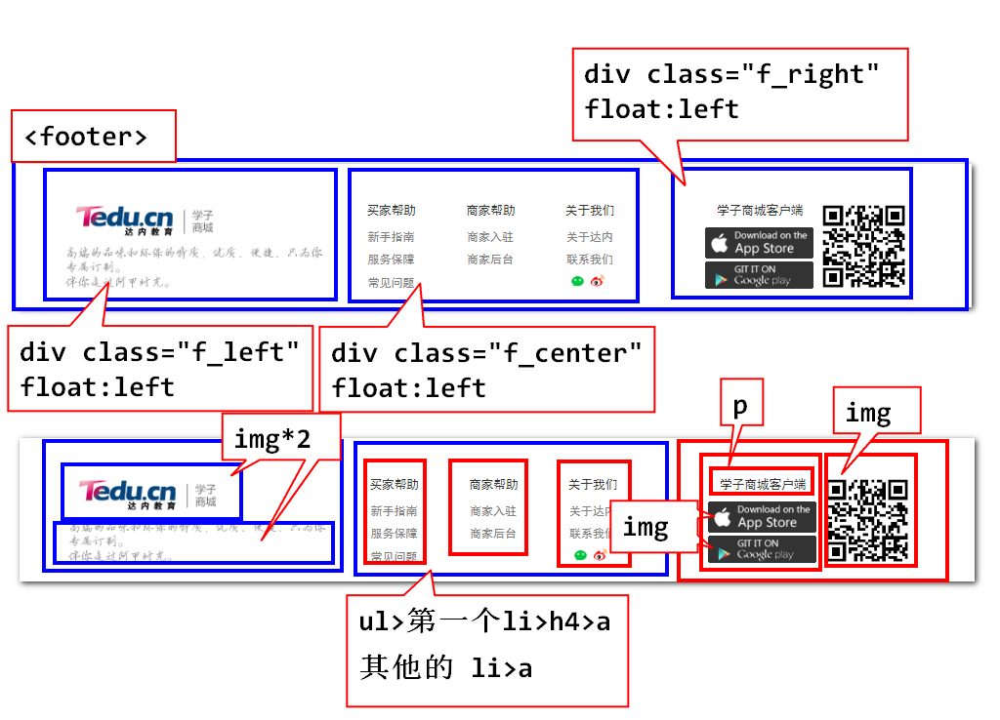

# day05
## 复习

### css常用样式

1. 布局相关---盒子模型
2. 背景属性---背景颜色和背景图片(平铺,大小,位置)
3. 字体属性
4. 文本属性
5. 边框属性
6. 常见复杂属性

	- display

		- 块级,独占一行,可以有宽高,margin上右下左都生效
		- 行内,从左到右依次摆放,宽高不生效,margin top,bottom不生效
		- 行内块 可以和其他行内块占一行.可以设置宽高

    - 浮动

		1. 浮动时候,如果本标签,上面的标签还处于文档流中,本标签的浮动,只在当前行浮动
		2. 如果本标签,上面的标签也浮动了,本标签会在上面标签那一行浮动
		3. clear:both,清除浮动,本标签不被上面浮动的其他标签覆盖
		4. 浮动多用于,块级元素横向显示

## 定位 position

		position:absolute;绝对定位
		position:relative;相对定位

### 总结,position会让标签脱离默认文档流,成为一个单独的层

### 1. 一个标签如果设置了position属性,就会解封另外4个属性 top left right bottom  离上边的距离

### 2. absolute,定位之后.原位置会被其他元素占用

### 3. relative,定位之后.原位置不会被其他元素占用

### 4. 如果父级标签没有写position,子标签absolute,那么子标签,相对浏览器左上角原定位

### 5. 子标签relative,不管父级是否有position属性,都是相对自己原来的位置,去定位

### 6. 父级标签写了position,子标签absolute,相对于父级标签左上角定位,同时支持margin

### 7. 子标签absolute,多重父级标签中,以最近的那层写了position属性的标签,左上角为原定定位(从内往外找)

## 总结写代码的套路:

	1. 如果标签原始位置不能被占用,使用relative,相对于自己原来位置,去定位.

	2. 如果标签原始位置需要被占用,使用absolute,但是需要在父级标签中添加position:relative;告诉子元素,以我定位!

### 关于层数

### 后写定位的层数高,z-index可以设置层数,数字越大,层数越高,层数高的先显示

### position:fixed;相对窗口定位

## 项目.学子商城登录页

	<header>
		
		欢迎登录
	</header>

		*{
			margin: 0px;
			padding: 0px;
			font-family: "黑体";
		}
		body{
			background-color: #f5f5f5;
			color: #666;
		}
		header{
			width: 1000px;
			height: 49px;
			margin: 20px auto;
		}
		header a{
			margin-left: 40px;
			float: left;
		}
		header span{
			margin-left: 10px;
			font-size: 24px;
			display: block;
			float: left;
			margin-top: 10px;	
		}

	

		<form action="">
			<h2>登录学子商城
				<a href="#">新用户注册</a>
			</h2>
		</form>
	

	.form-panel form{
		width: 280px;
		background-color: rgba(0,0,0,0.3);
	/* 	border: 2px solid red; */
		float: right;
		color: #fff;
		margin-top: 120px;
		margin-right: 100px;
		padding-top: 18px;
	}
	.form-panel h2{
		border-bottom: 1px solid #fff;
		padding-bottom: 12px;
		margin-left: 10px;
		margin-right: 10px;
		font-size: 20px;
		
	}
	.form-panel h2 a{
		color: #fff;
		text-decoration: none;
		font-size: 12px;
		font-weight: lighter;
		float: right;
		margin-top: 12px;
		margin-right: 10px;
	}

-- 在form标签中

	

		<input type="text" placeholder="请输入用户名">
		
		用户名输入错误
	

	

		<input type="password" placeholder="请输入密码">
		
		密码输入错误
	

		.field{
			position: relative;/* 为了内部元素以我定位 */
			margin: 12px 10px;
		}
		.field input{
			width: 246px;
			height: 22px;
			padding: 5px 5px;
			
		}
		.field img{
			position: absolute;
			top: 4px;
			right: 8px;	
		}
		.error{
			color: #f00;
		}
		.ok{
			color: #0f0;
		}
		.field span{
			display: block;
			font-size: 12px;
			padding-top: 10px;
			padding-bottom:5px;
		}

			

				<input type="checkbox" id="save">
				<label for="save">自动登录</label>
				<a href="#">忘记密码?</a>
			

			

				<input type="submit" value="登录">
			

		.checkbox{
			margin-left: 12px;
		}
		.checkbox label{
			font-size: 12px;
			position: relative;
			top:-3px;
			left: -6px;
		}
		.checkbox a{
			text-decoration: none;
			font-size: 12px;
			color: #fff;
			position: relative;
			top: -3px;
			left: 122px;
		}
		.btn{
			/* 微调 */
			margin-left: 10px;
			padding-bottom: 20px;
			padding-top: 5px;
		}
		.btn input{
			display: block;
			width: 260px;
			height: 37px;
			background: -webkit-linear-gradient(top, #27b0f6 0%, #0aa1ed 100%);
			border: none;
			border-radius:2px;
			font-size: 18px;
			color: #fff;
			font-family: "黑体";
			cursor: pointer;
		}
		/* 鼠标在点击和释放之间,称之为激活 */
		/* :active为激活时添加样式 */
		.btn input:active{
			color: #ff0;
		}

	<ul class="server">
		<li>
			
			
品质保障

		</li>
		<li>
			
			
私人定制

		</li>
		<li>
			
			
学员特供

		</li>
		<li>
			
			
专属特权

		</li>
	</ul>

	.server{
		width: 1000px;
		margin: 0px auto;
	}
	.server li{
			width: 65px;
			float: left;
			list-style: none;
			margin: 40px 92px;
	}

## 作业:

1. 深刻理解定位
2. 完成学子商城登录页面

3. 完成学子商城商品展示首页(提高)

