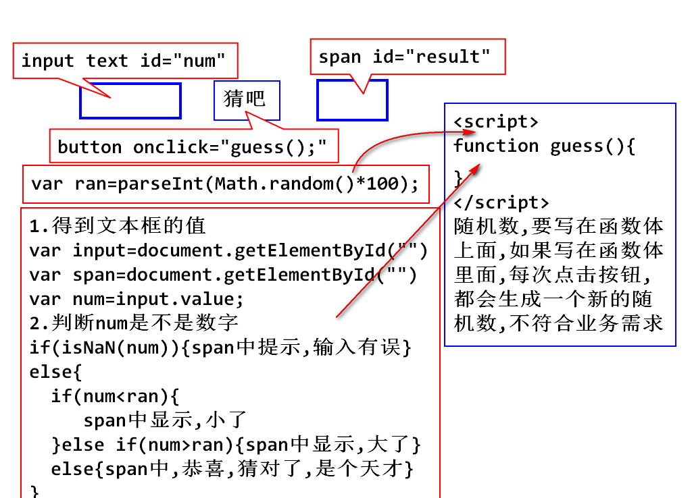

# day06

## JavaScript

### 网页所有的交互都要使用JavaScript

## Javascript的发展

### 网景找到ECMA(欧洲计算机联盟协会)统一了Javascript标准
### 我们要学习的就是这一套统一的标准

### JavaScript的特点

1. 可以使用任何文本编译工具编写
2. 由浏览器内置的JavaScript引擎执行代码
3. 解释执行:事先不编译,逐行执行
4. 基于对象:内置了大量写好的对象

### 学习javascript
### 1. 学习如何找到标签对象
### 2. 学习对标签对象的属性内容,进行增删改查.

## JavaScript的使用

1. 事件定义式,在事件定义时直接写js代码

	<!-- 事件:用户在做出某种操作时,会调用js代码  -->
	<!-- 事件就是js调用时机,比如单击按钮等 -->
	<!-- 1.事件定义式,在定义事件时,直接写js代码 -->
	<input type="button" value="事件定义式"
	onclick="alert('我被单击了');">

2. 嵌入式,在`

### 总结:
### 文件调用式,在单独的.js文件写js代码
### 需要引用到网页才能使用
### 引用时:script标签必须是双标签,哪怕没有内容
### 这个script作用就是导入外部的js文件,
### 不允许同时引用文件,又写js代码

4. js注释:`

### 总结:在`

### 数学运算符 + - * / %  ++
### 总结:
### 1.纯数字的字符串,除了+会变成字符串连接,其他的运算都会自动转成数字
### 2.js中的除法,如果除不尽会得到浮点数100/3

### 关系运算符 > < >= <= != ==

	

### 课堂练习:网页版猜数字

### 逻辑运算符  ! && ||  
### 要注意短路问题

### 条件表达式
### js可以使用任何数据做条件

		if("afsda"){
			console.log(1111);
		}

### 当使用非boolean值做条件时
### true  非空字符串 非0数字
### false null undefined "" 0 NaN

	if(NaN){

	}else{
		console.log(11111);
	}

## 作业:
### 今天所有的理论和demo重新过一遍
### 1.猜数字和平方
### 2.提高题:选作

426029026218 2
求出前12位奇数位数字之和.462061=19
求出前12位偶数位数字之和.209228=23
把 前12位奇数位数字之和 与 偶数位数字之和的3倍相加.19+69=88
取结果的个位数.	8
用10减去这个个位数.	2
再取结果的个位数.	2

for(var i=0;i<12;i++){
console.log(i);
}

