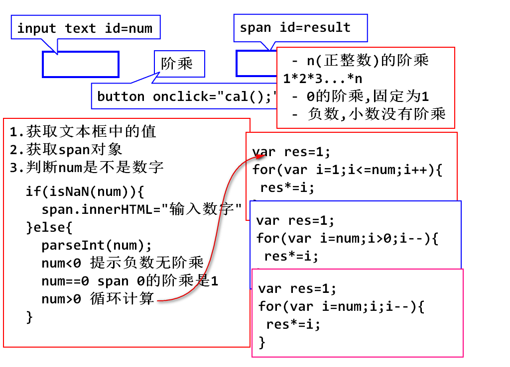
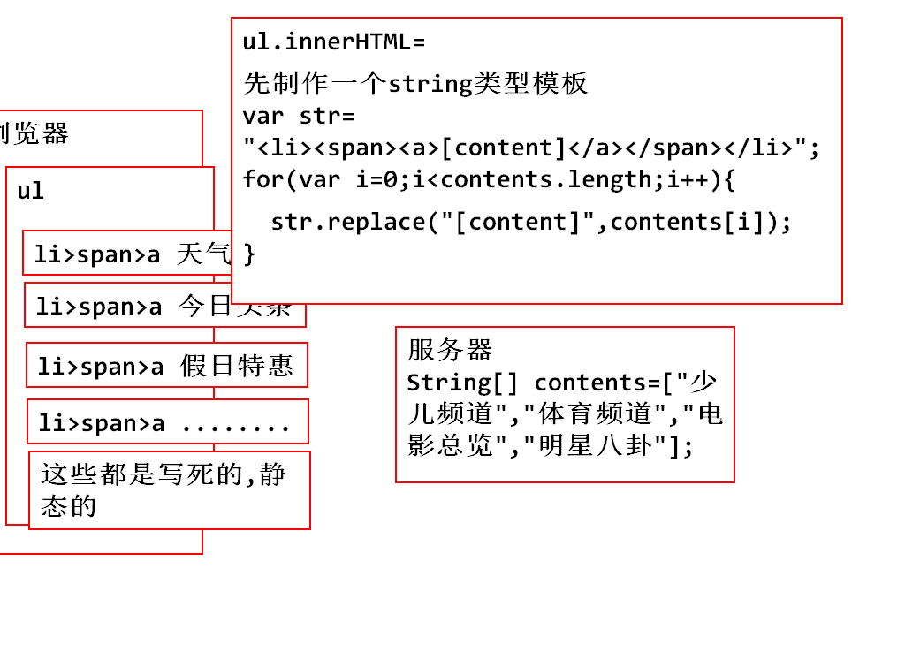
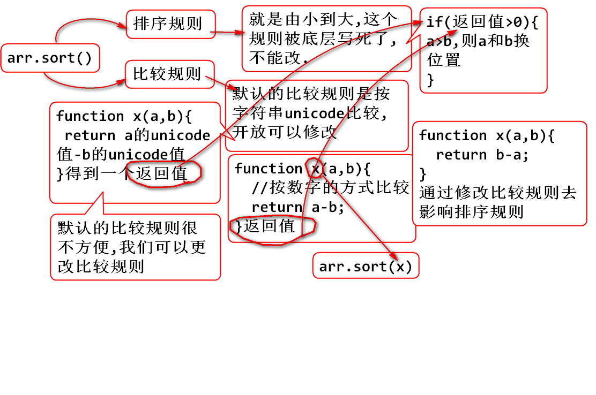

#day 07

## 复习
### js的历史
### js的使用方式
### 变量的声明与定义 var x=123; x="abc"
### 数据类型 number string  boolean null undefined
### NaN isNaN() typeof() parseInt()
### ! && ||
### < > <= >= == != ===
### if else     if(可以放任何值当做boolean表达式)

## 循环 for while do-while

### 输入1-100,计算该数的阶乘 

	- n(正整数)的阶乘 1*2*3...*n
	- 0的阶乘,固定为1
	- 负数,小数没有阶乘

		
n(正整数)的阶乘 1*2*3...*n

		
0的阶乘,固定为1

		
负数,小数没有阶乘

		<input type="text" id="num">
		<input type="button" value="阶乘"   
		onclick="cal();">
		

		

## javascript常用API

### string

### 1.创建string对象的2种方式

	var str1="hello world";
	var str2=new String("hello world");

### 2.大小写的转换

	str.toLowerCase();
	str.toUpperCase();

### 3.获取指定的字符(串)

	str.charAt(index);

	var str="javascript网页教程";
    var str1=str.charAt(12);

### 4.查询指定的字符串

	str.indexOf("");
	str.lastIndexOf("");

	var str="javascript网页教程";
	var index=str.indexOf("a");
	var index=str.lastIndexOf("a");

### 5.获取子字符串

		str.substring(star,[end]);
		var str="abcdefghi";
		//包头不包尾
		var str1=str.substring(2,4);

### 6. 替换子字符串

		str.replace(str1,str2);
		str1--要找到的字符串
		str2--新的字符串
		返回值是替换后的字符串

		var str="abcde";
		var str1=str.replace("cd","aaaa");

### 7.拆分子字符串

		str.split(str1,[length]);
		str1--分割用的子字符串
		length,指定返回数组的最大长度,可省略
		返回值为,分割之后的字符串数组

		var str="一,二,三,四,五,六,日";
		var strArray=str.split(",",5);

### 课堂练习

	<ul id="ul">
	
	</ul>

	
		
## Number对象的常用方法
		
		toFixed(length):把number转换为字符串,保留小数点后一定的位数.如果必要,该数字会被四舍五入,也可以用0补足位数

## 数组

### js中的数组特点

	var arr=["打一顿","不多于",12.3,true];
	
	var arr1=new Array();
	arr1[0]="123";
	arr1.push(23);

1. Array在js中都是obj的数组
2. js中数组可以同时存放不同数据类型的值
3. js中的长度可变
4. 两种创建方式,不管哪一种,创建出来,都是object类型

5. 数组常用api

		arr.reverse() // 反转输出
     
### arr.sort();//排序

### sort方法,是按照数组中,每一个元素的unicode编码进行排序的,比完第一位比第二位
### string就是这样排序,但是这种排序不适用于number

	
		var arr=[5,12,3,14,26,1];
		//var arr=["a","ab","b","c","bd","d"];
		//console.log(arr.sort());//1,3,5,12,14,26
		
		//修改比较规则,按照数字大小比较
	/* 	function x(a,b){
			return b-a;
		} */
		arr.sort(function(a,b){
			return a-b;
		});

### math

	console.log(Math.round(4.56));
	Math.floor(4.5);

### date 

1. 创建客户机当前时间

	var d1=new Date();

2. 创建指定时间的date对象(指定时间一般源于服务器)

	var d2=new Date("2016/12/12 12:12:12");

3. 读写时间的毫秒数

		getTime()读  setTime()写

###　date的API
### 从服务器拿到时间对象,在页面根据不同的需求显示

		d1.getFullYear();//获取年
		d1.getMonth();//获取月,需要+1
		d1.getDate();//月的天
		d1.getDay();//周的天

		d1.getHours();//获得小时
		d1.getMinutes();//分钟
		d1.getSeconds();//秒

### date转化成本地时间格式

	d1.toString();
	d1.toLocaleTimeString();
	d1.toLocaleDateString();

### 正则

	.  任意字符
	\w 任意字母,数字,下划线
	\s 任意空白字符
	\d 任意数字
	^	字符串开头
	$	字符串结束

### 1.如何创建正则对象

	- 直接创建

		var reg=/正则表达式/[模式]
		var reg=/no/g;

	- 创建对象

		var reg=new RegExp(正则表达式,[模式]);
		var reg=new RegExp('\s\d');//此句有坑

	- 全局模式,设定当前匹配为全局,g
	- 设置当前匹配模式忽略大小写,i

### 2.正则对象的方法 reg.XXX(str);

	reg.exec(str);
	//从str中找到匹配正则的子串
	//普通模式下,返回第一个符合要求的子串
	//全局模式下,第n次执行,返回符合要求的第n个子串

	var str="you can you up,no can no bi bi";
	var reg=/no/g;
	//reg.exec(str);
	//从str中找到匹配正则的子串
	//普通模式下,返回第一个符合要求的子串
	//全局模式下,第n次执行,返回符合要求的第n个子串
	console.log(reg.exec(str));
	console.log(reg.exec(str));
	console.log(reg.exec(str));
	console.log(reg.exec(str));

	//reg.test(str);
	//判断str中是否 包含与reg匹配的子串
	console.log(reg.test(str));

### 3.字符串匹配正则的方法 str.XXX(reg);		

		1. str.replace(reg,"");
		
		将str中的与reg匹配的所有子串都替换成目标子串

		var str="you can you up,no can no bi bi";
		var reg=/no/g;
		var str1=str.replace(reg,"bu");
		console.log(str1);

		2. str.match(reg);

		   从str中找出和reg匹配的子串,返回值是数组
	
		var str="you can you up,no can no bi bi";
		var reg=/no/g;
		//var str1=str.replace(reg,"bu");
		//console.log(str1);
		console.log(str.match(reg));

		3. str.search(reg);

			从str中找出和reg匹配的第一个子串的索引

			console.log(str.search(reg));

## 作业
### 全天笔记要求过一遍
### arr.sort();原理,可以表述清晰
### 背表单验证的代码

