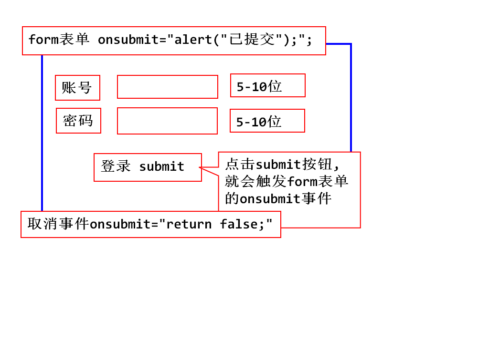
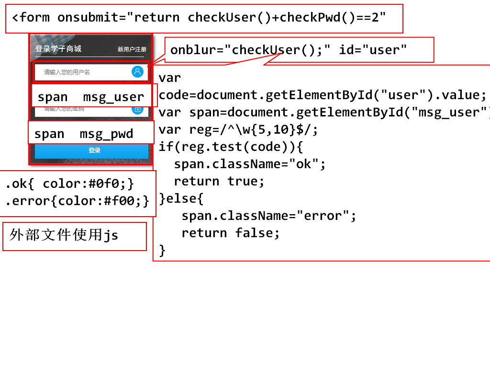
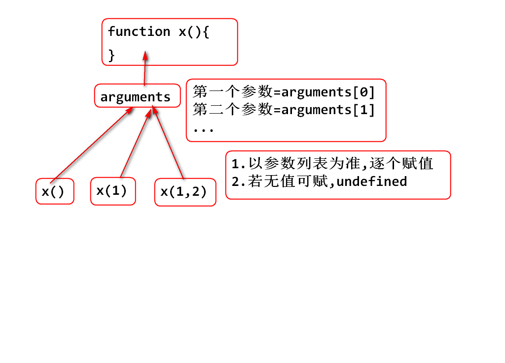
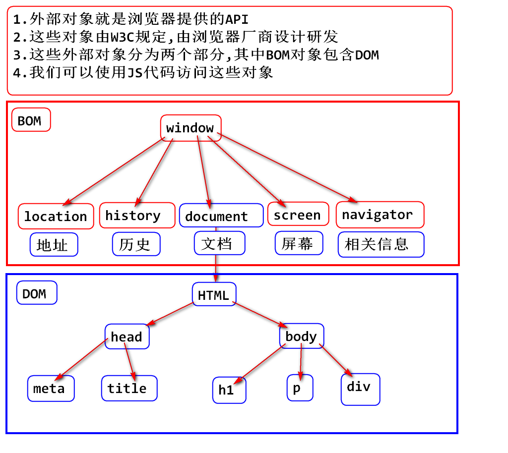
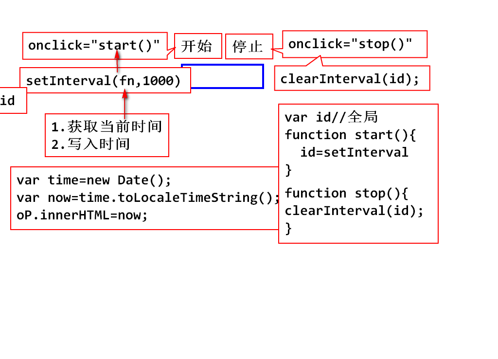
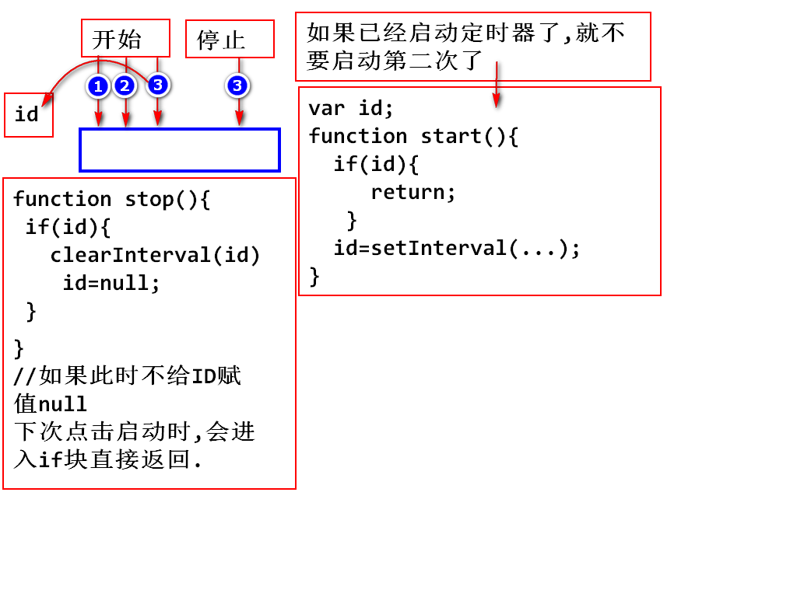
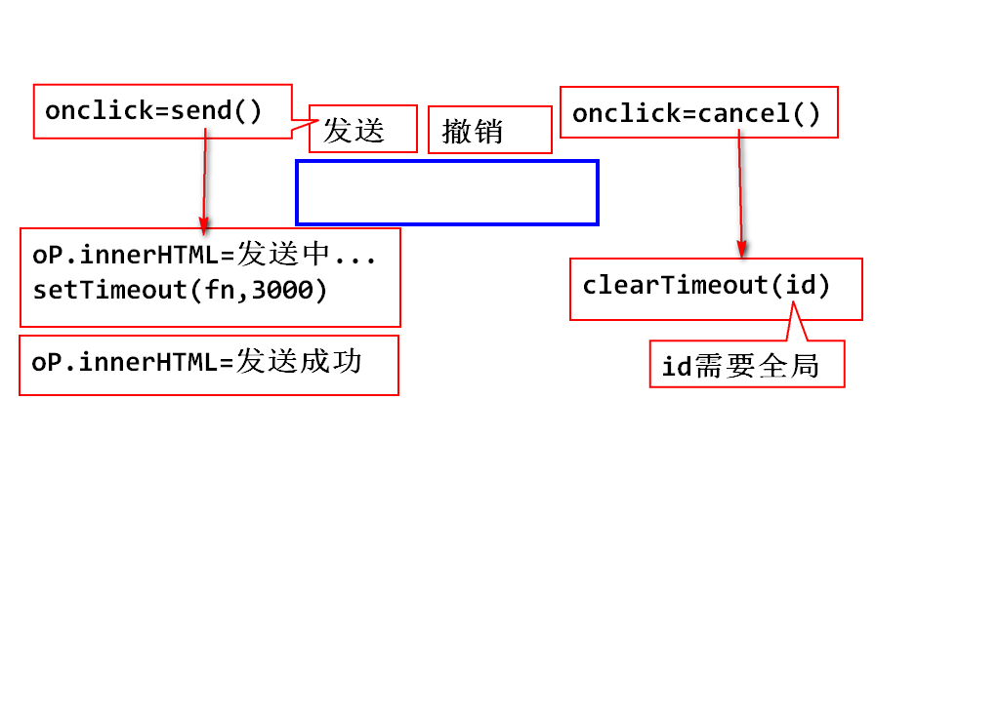

# day08
## js中的常用API

## 完善form表单的验证

		<body>
			<form action="http://www.tmooc.cn"   
			onsubmit="return checkUser()*checkPwd()==1;">
				

					账号:<input type="text" id="username" 
					onblur="checkUser();">
					5-10位数字,字母,下划线
				

				

					密码:<input type="password" id="pwd" 
					onblur="checkPwd();">
					5-10位数字,字母,下划线
				

				

					<input type="submit" value="登录">
				

			</form>
		</body>

		

		

## 学子商城登陆页表单验证

## function对象
### 1.js中函数就是function对象
### 2.函数名就是指向function对象的引用

    var fn1=function(){alert(1111);}
	function fn2(){
		alert(1111);
	}

### 3.使用函数名可以访问函数对象
### 4.函数名后面跟上(),是调用函数
### 5.函数的返回值

	- 不定义返回值的类型
	- 默认返回值是undefined
	- 可以使用return返回具体的值

### 6.函数的参数 var 

		function x(){
			alert(arguments[0]);
		}

		x();

		x(1,2);//不报错,问题是1和2究竟哪去了

### JS的函数没有重载
### 函数被调用时,只要函数名一样,无论传入多少个参数,调用的都是同一个函数对象,所以js没重载
### 但是可以实现和重载一样的调用方式,使用arguments

### 代码演示 

### 定义一个函数,参数连续相加,返回累加和
		
		function add(){
		  var sum=0;
		  for(var i=0;i<arguments.length;i++){
		     sum+=arguments[i];
		  }
		  return sum;
		}

### js在调用函数的过程中,只检测函数名,不检测参数列表
### 如果参数名称匹配,则直接调用
### 可以使用arguments访问传递过来的参数列表
### js中没有重载,如果出现相同函数名的两个函数,后一个有效

### 匿名函数
### 就是不给函数起名字
### 如果一个函数在别的地方不再被调用了,就可以使用匿名函数

### 全局函数
### 全局函数可用于所有的javaScript对象
### 不需要对象调用
### 常用全局函数

		typeof()
		isNaN();
		parseInt();
		parseFloat();

### eval()
### eval函数用于 计算 表达式 字符串

		var str="2+3"; 	
		eval(str);

### eval函数用于 执行 字符串中的js代码

		var str="function aa(){alert(1111);}aa();";
		eval(str);

### eval最重要的作用,是动态执行服务器传过来的javascript代码

		<body>
			<input type="text" id="num">
			<input type="button" value="计算" 
			onclick="cal();">
		</body>

		
		
## 外部对象概述
### BOM与DOM

### BOM Browser Object Model 浏览器对象模型
### DOM Document Object Model 文档对象模型

### 总结:通过BOM,可以移动窗口,更改状态栏文本
### 执行其他不与页面内容发生直接联系的操作(不操作标签)
### BOM是没有标准,却被浏览器厂商广泛支持

### 总结:DOM定义了访问和操作HTML的标准方法
### 通过对DOM树的操作,来实现对html文档数据的操作

## JS相关BOM操作
### window 表示整个浏览器窗口
### 所有js的全局对象,全局函数以及全局变量,都自动成为window对象的成员(window可以点出来)

### window的常用属性

		document  窗口中显示的HTML文档对象
		history   浏览过的历史记录对象
		location  窗口文件地址对象
		screen    屏幕对象
		navigator 浏览器相关信息对象

## window对象常用的函数

1. 弹出框

		<body>
			<input type="button" value="按钮1"  
			onclick="fn1();">
			<input type="button" value="按钮2"  
			onclick="fn2();">
			<input type="button" value="按钮3"  
			onclick="fn3();">
		</body>

		

## 定时器
### 主要用于网页动态时钟,倒计时,轮播图,无缝滚动,跑马灯效果

### 1.周期性定时器
### 以一定的时间间隔执行代码,循环往复
	
	setInterval(exp,time);
	exp:要执行的js语句,一般为匿名函数
	time:时间周期,毫秒 
	返回值:返回已经启动的定时器ID
	clearInterval(ID);停止定时器

	//周期性定时器
	function fn4(){//每一秒打印一个数 5,4,3,2,1
		var num=5;
		var id=setInterval(function(){
			console.log(num--);
			if(!num){// num==0
				clearInterval(id);
			}
		},1000);
		console.log("蹦蹦");
	}

### 总结:启动定时器就相当于启动了一个子线程
### 当前方法fn4相当于主线程
### 2个线程之间并发执行,相互不等待

### 课堂练习,电子时钟

	

		<input type="button" value="开始" onclick="start();">
		<input type="button" value="停止" onclick="stop();">
		

	

		

		

### 2.一次性定时器(延迟执行)
### 在一个设定好的时间 间隔之后来执行代码

		setTimeout(exp,time);
		exp:执行的代码
		time:延迟时间
		返回值为id
		clearTimeout(id);

### 发送撤销的案例

		
		
		</head>
		<body>
			

				<input type="button" value="发送" 
				onclick="send();">
				<input type="button" value="撤销" 
				onclick="cancel();">
			

			

		</body>

## 作业
1. 今天笔记过一遍
2. 学子商城登陆页面表单验证,敲一遍
3. 两个定时代码(第二个调BUG)
4. 预习DOM

