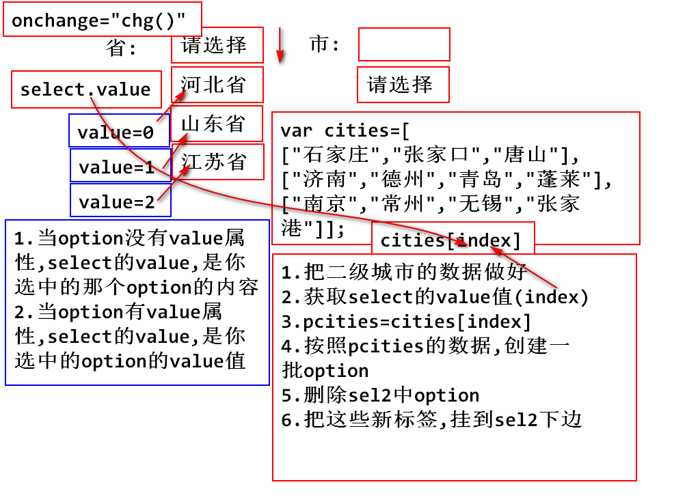
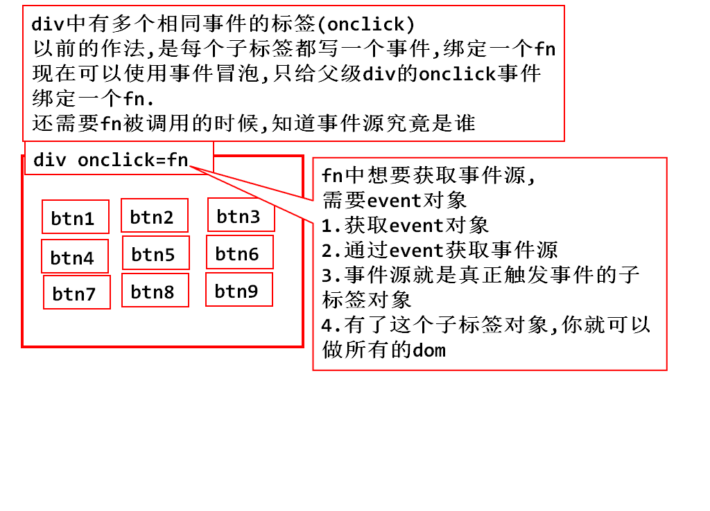
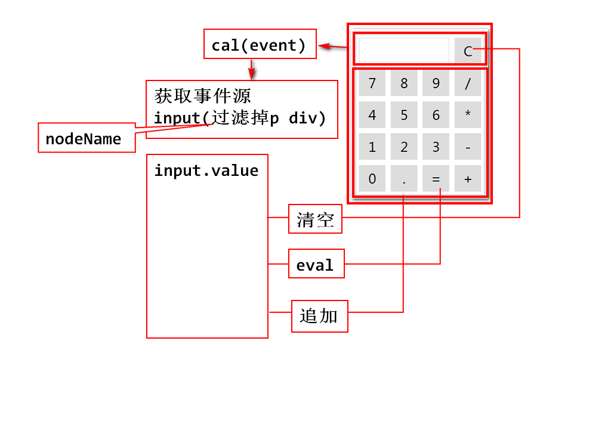

#day10

## 复习
### DOM节点的操作

#### 读写

		1. nodeName/nodeType
		2. innerHTML/innerText
		3. value
		4. getAttribute/setAttribute
		   .className .id .style

#### 查询

		1. ById
		2. ByTagName
		3. parentNode/ByTagName()
		4. ByName

#### 增删节点

		1. createElement(TagName)
		2. parent.appendChild(newNode)
		3. parent.insertBefore(newNode,弟弟对象)
		4. parent.removeChild(节点对象)

## 课堂练习:二级联动菜单

		<body>
			省:
			<select onchange="chg();" id="province">
				<option value="-1">请选择</option>
				<option value="0">河北省</option>
				<option value="1">山东省</option>
				<option value="2">江苏省</option>
			</select>
			市:
			<select id="city">
				<option>请选择</option>
			</select>
		</body>

			

## javascript事件处理

### 事件:指页面元素状态的改变,用户在操作鼠标或者键盘时触发的动作

### 1.鼠标事件

		- onclick
		- ondblclick
		- onmouseover//鼠标悬停
		- onmouseout//鼠标离开
		- onmousedown//鼠标按下事件
		- onmouseup//鼠标抬起事件

### 2.键盘事件
		
		- onkeydown
		- onkeyup

### 3.状态改变事件

		- onload
		- onchange
		- onfocus//焦点获取
		- onblur//失去焦点
		- onsubmit

### 事件绑定

1. 在标签属性中,直接处理事件

	<input type="button" value="按钮1"
	 onclick="fn1();">

2. js代码中动态定义,可以把html代码和js代码分离,好维护

		window.onload=function(){
			var input=document
			.getElementsByTagName("input")[0];
			
			input.onclick=fn2;
		}
		function fn2(){
			console.log("动态定义事件绑定");
		}

3. 取消事件 onXXX="return false";

## 事件处理机制--事件冒泡

	

		

		div--p--btn
			<input type="button" value="事件冒泡的演示" 
			onclick="alert('input');">
		

	

### 如果点击input,将会依次触发input/p/div的onclick事件,这种现象称为事件冒泡
### 发生事件冒泡的要求,1.嵌套关系.2.内层和外层标签必须是同一个事件

### 取消事件的冒泡,由于浏览器厂商使用的内核不同,有两种方法取消

		1. event.stopPropagation();

### 总结:以前只支持firefox chrome.现在高版本的ie已经支持了.ie8.0及其以下的版本不支持

		2. event.cancelBubble=true;

### 总结:以前只支持IE,现在在高版本的FF和chrome中已经支持了

### 	

### 4.event对象,事件对象(*****)

	- 事件触发后,会自动产生一个event

#### 1.获取event对象

#### 任何事件触发后都会产生一个event对象
#### event对象记录事件发生时的鼠标位置,键盘按键状态和触发对象(事件源)等信息

1. 在html属性中直接使用event对象

	<!-- 在html属性中直接使用event对象 -->
	<input type="button" 
	value="HTML_for_IE-FF-chrome" 
	onclick="alert(event.clientX+':'+event.clientY);">

### 虽然支持ie ff chrome但是这种写法,是没有意义的.
### 我们希望html代码和js代码,分离.松耦合

2. 在js代码块中,直接使用event对象

	<!-- 在js代码块中,直接使用event对象 -->
	<input type="button" value="js_for_chrome-IE" 
	onclick="fn1();">

### IE浏览器和chrome..chrome对ie做了兼容.

3. 在函数中使用event对象,必须以传参的方式

	<!-- 在函数中使用event对象,必须以传参的方式 -->
	<input type="button" value="for_FF-IE-chrome" 
	onclick="fn2(event);">

	function fn2(event){
		alert(event.clientX+':'+event.clientY);
	}

### 这种方式,ff ie chrome都支持,所以开发要求这种写法

### 通过event对象获取事件源

### 1.IE和chrome,chrome对IE做了兼容

	<!-- 获取事件源 -->
	<input type="button" value="事件源_IE-chrome" 
	onclick="fn3(event);">

	function fn3(event){
		var obj=event.srcElement;
		console.log(obj);
	}

### 2.Firefox和chrome,高版本IE也支持
### IE8.0及以下不支持

### 计算器案例

#### 关于this的使用

	

		<input type="button" value="X" onclick="fn(this);">
		<input type="button" value="X" onclick="fn(this);">
		<input type="button" value="X" onclick="fn(this);">
		<input type="button" value="X" onclick="fn(this);">
	

	

## 作业
### 1.事件冒泡,取消冒泡
### 2.获取event对象
### 3.通过event对象,获取事件源
### 4.计算器能在不看资料的情况下,正确完成
### 5.完成一遍二级联动

