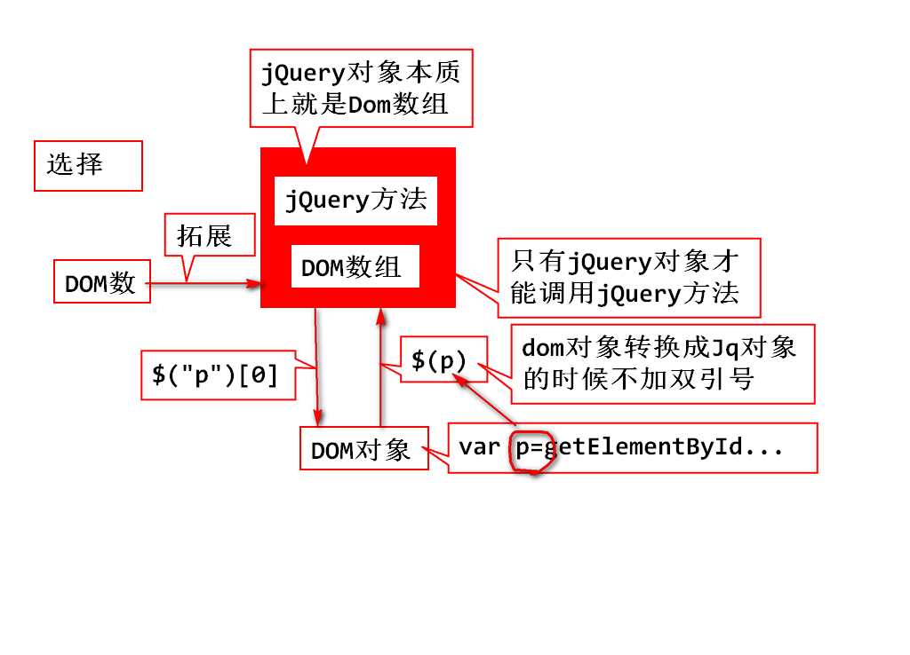

# day11
## jQuery

	function bigger(){
		//1.获取p的字号
		var size=$("p").css("font-size");
		//把"16px"变成可以计算的数字,去掉单位
		size=size.replace("px","");
		//字号加大号,设置p标签的字号
		$("p").css("font-size",++size +"px");
	}

## jQuery对象详解

## jQuery的常用选择器
### jQuery选择器可以准确选取到你希望找到的元素
### 选择器允许你的HTML元素组或者单个元素进行操作

	<ul>
		<li>北京</li>
		<li>上海</li>
		<li id="gz">广州</li>
		<li class="sz">深圳</li>
		<li>佳木斯儿</li>
	</ul>

		$(function(){
			//1.基本选择器
			$("li");
			$("#gz");
			$(".sz");
			$("ul li");
			$("ul>#gz");
			$("ul .sz");
			//2.层次选择器
			$("#gz+li");//选择他的弟弟
			$("#gz~");//选择他的弟弟们
			//3.过滤选择器
			//4.表单选择器
		});

### 3.过滤选择器
		
#### 1.基本过滤器

		$("li:first");
		$("li:lt(2)");//下标小于index的标签
		$("li:odd");
		$("li:last");

		$("li:eq(0)");
		$("li:not(#gz)")
		
#### 2.内容过滤器

		$("li:contains('州')")	
		$("li:empty")	

#### 3.可见性过滤器

		$("li:hidden")

#### 4.属性过滤器,不是:开头,是中括号[]!

		<li style="...."></li>
		$("li[style]")//li标签带有style属性
		$("[href='#']")//带有href属性并且,值为'#'
		$("[href!='#']")//带有href属性,并且值不为"#"
		$("[href$='.jpg']")//有href,值以'.jpg'结尾

#### 5.状态过滤器

		$("input:disabled")
		$("input:checked")

#### 6.表单过滤器9种

		$(":text");

## jQuery操作DOM

### 1.jQuery对内容和值的操作

		var str=obj.html();
		obj.html("123");

		var str=obj.text();
		obj.text("123");

		var str=obj.val();
		obj.val("abc");
		
		obj.attr("属性名");
		obj.attr("属性名","属性值");

		<body>
			
jQuery支持<b>读写</b>节点

			
jQuery支持<b>增删</b>节点

			
			

				<input type="button" value="点点我" onclick="fn1();">
			

		</body>

		function fn1(){
			console.log($("p:eq(0)").html());
			console.log($("p:eq(1)").text());
			$("img").attr("src","../img/13.png");
			$(":button").val("别点我");
			//更改两个P标签的中文本内容,<u></u>
			//html(),text();
			//打印当前img的src值
			//打印当前button的value值
		}

### 2.jQuery增删节点

#### 2.1 创建新节点

		var oSpan=$("你好");

#### 2.2 挂到DOM树上

		parent.append(obj);//做为最后子节点添加进来
		parent.prepend(obj);//做为第一个
		brother.before(obj);//做为上一个兄弟节点
		brother.after(obj);//做为下一个兄弟节点

	

		<input type="button" value="追加" onclick="fn1();">
		<input type="button" value="插入" onclick="fn2();">
		<input type="button" value="删除" onclick="fn3();">
	

	<ul>
		<li>北京</li>
		<li>上海</li>
		<li id="gz">广州</li>
		<li>深圳</li>
		<li>杭州</li>
	</ul>

	function fn1(){//追加
		var oLi=$("<li>天津</li>");
		$("ul").append(oLi);
		//$("ul").prepend(oLi);
	}
	function fn2(){//插入
		var oLi=$("<li>西安</li>");
		//$("#gz").before(oLi);
		$("#gz").after(oLi);
	}

#### 2.3删除DOM节点

		obj.remove(); //删除这个节点
		obj.remove(selector);//只删除满足selector条件的节点

### 样式操作 add remove has css toggle

	obj.addClass("ok")
	obj.removeClass("error");//移除指定的样式
	obj.removeClass();//移除所有样式
	obj.hasClass("ok")//判断是否有某个样式
	obj.toggleClass("ok");//切换样式

	obj.css("样式属性","样式的值");//设置具体样式
	obj.css("样式属性");//获得具体样式的值

	$("p").addClass("red").addClass("big");

	$(function(){
		setInterval(function(){
			$("p").toggleClass("big").toggleClass("red");
		},500);
	});

## jQuery方法的返回值

### 1.任何通过$得到对象的都是jQuery对象

	1. 选择器过滤器  $("p")
	2. 转型:Dom-->jQuery对象  $(Dom)

		var oP=document.getElementsByTagName("p")[0];
		$(oP).addClass(...)

	3. 创建新节点

		$("

")

### 2.修改方法一般都返回jQuery对象
		
	obj.html("abc")
	obj.attr("src","../img/06.png")
	obj.addClass("red").removeClass("red")

### 3.查询到的元素一般都是jQuery对象

### 4.读取到的文字,返回值是string对象

		obj.val();
		obj.html();
		obj.text();

### 5.万能确认对象的方式

		控制台输出,看对象结构

## 作业

1. 今天(2018年5月11日)所有笔记,熟悉
2. 今天(2018年5月11日)所有demo,重新敲
3. 预习

	

		

		

