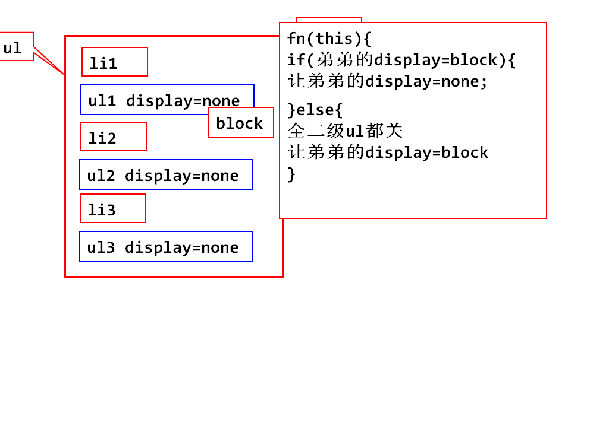

#day12

## 复习
### 读写内容

		obj.html();/obj.html("");
		obj.test();/obj.test("");
		obj.val();/obj.val("");

### 增删节点

### 1.创建新节点

		$("嘿嘿嘿")

### 2.挂到dom树上

		parent.append(obj)//添加最后一个子节点
		parent.prepend(obj)//添加第一个子节点
		brother.after(obj);//添加一个弟弟节点
		brother.before(obj);//添加一个哥哥节点

### 3.删除节点

		obj.remove();
		obj.remove(selector);//满足selector条件的节点被删除
		obj.empty();
		parent.html("");

### 对样式的操作

		obj.addClass("");
		obj.removeclass("");//删除某一个class
		obj.removeclass();//删除所有的样式
		obj.hasClass("")//是否应用了某一个样式
		obj.toggleClass("");//切换某一个样式

### jQuery方法的返回值问题

## 通过节点关系,查找节点

	obj.children();/obj.children(selector);//获取直接子节点
	obj.next();/obj.next(selector);//下一个弟弟
	obj.prev()/obj.prev(selector);//上一个哥哥
	obj.siblings();/obj.siblings(selector)//查询所有的兄弟,结果不含自己

	obj.find(selector);//查找满足条件所有后代
	obj.parent();

### 课堂练习

		<body>
			<ul id="nav">
				<li><a href="#" class="navLink">达内java</a></li>
				<ul class="menu">
					<li><a href="#">课程介绍</a></li>
					<li><a href="#">研发团队</a></li>
					<li><a href="#">讲师风采</a></li>
					<li><a href="#">联系我们</a></li>
				</ul>
				<li><a href="#" class="navLink">达内java</a></li>
				<ul class="menu">
					<li><a href="#">课程介绍</a></li>
					<li><a href="#">研发团队</a></li>
					<li><a href="#">讲师风采</a></li>
					<li><a href="#">联系我们</a></li>
				</ul>
				<li><a href="#" class="navLink">达内java</a></li>
				<ul class="menu">
					<li><a href="#">课程介绍</a></li>
					<li><a href="#">研发团队</a></li>
					<li><a href="#">讲师风采</a></li>
					<li><a href="#">联系我们</a></li>
				</ul>
				<li><a href="#" class="navLink">达内java</a></li>
				<ul class="menu">
					<li><a href="#">课程介绍</a></li>
					<li><a href="#">研发团队</a></li>
					<li><a href="#">讲师风采</a></li>
					<li><a href="#">联系我们</a></li>
				</ul>
				<li><a href="#" class="navLink">达内java</a></li>
				<ul class="menu">
					<li><a href="#">课程介绍</a></li>
					<li><a href="#">研发团队</a></li>
					<li><a href="#">讲师风采</a></li>
					<li><a href="#">联系我们</a></li>
				</ul>
			</ul>
		</body>
		
		

		

### 课堂练习,学子商城二级菜单
		
		$(function(){
			$(".menu").click(function(){
				if($(this).next().css("display")=="block"){
					//把所有的ul都关闭
					//所有的箭头都向右
					$(".submenu").removeClass("dis")
					.addClass("hide");
					$(".menu").children("img")
					.attr("src","../images/myOrder/myOrder1.png");
				}else{
					//关闭所有ul,把箭头向右
					$(".submenu").removeClass("dis")
					.addClass("hide");
					$(".menu").children("img")
					.attr("src","../images/myOrder/myOrder1.png");
					//打开弟弟ul,把箭头向下
					$(this).next().removeClass("hide")
					.addClass("dis");
					$(this).children("img")
					.attr("src","../images/myOrder/myOrder2.png");
				}
			});
		});
	
### 课堂练习

	<body>
	<h1>真划算</h1>
	<table>
	<tr>
		<th>商品</th>
		<th>单价(元)</th>
		<th>颜色</th>
		<th>库存</th>
		<th>好评率</th>
		<th>操作</th>
	</tr>
	<tr>
		<td>苹果air</td>
		<td>26000</td>
		<td>银色</td>
		<td>12</td>
		<td>50%</td>
		<td align="center">
			<input type="button" value="加入购物车" 
			onclick="add_shoppingcart(this);">
		</td>
	</tr>
	<tr>
		<td>迪奥口红</td>
		<td>300</td>
		<td>#520</td>
		<td>800</td>
		<td>99%</td>
		<td align="center">
			<input type="button" value="加入购物车" 
			onclick="add_shoppingcart(this)">
		</td>
	</tr>
	<tr>
		<td>戴森吹风机</td>
		<td>3200</td>
		<td>红色全球限量</td>
		<td>3</td>
		<td>100%</td>
		<td align="center">
			<input type="button" value="加入购物车" 
			onclick="add_shoppingcart(this)">
		</td>
	</tr>
	<tr>
		<td>卫聋辣条</td>
		<td>2</td>
		<td>无色变态辣</td>
		<td>5000</td>
		<td>100%</td>
		<td align="center">
			<input type="button" value="加入购物车" 
			onclick="add_shoppingcart(this)">
		</td>
	</tr>
	<tr>
		<td>樱桃机械键盘</td>
		<td>560</td>
		<td>黑色</td>
		<td>50</td>
		<td>100%</td>
		<td align="center">
			<input type="button" value="加入购物车" 
			onclick="add_shoppingcart(this)">
		</td>
	</tr>
	<tr>
		<td>大宝sod蜜</td>
		<td>26</td>
		<td>乳白色</td>
		<td>5000</td>
		<td>100%</td>
		<td align="center">
			<input type="button" value="加入购物车" 
			onclick="add_shoppingcart(this)">
		</td>
	</tr>
	</table>
	<h1>购物车</h1>
	<table>
		<thead>
			<tr>
				<th>商品</th>
				<th>单价(元)</th>
				<th>数量</th>
				<th>金额</th>
				<th>删除</th>
			</tr>
		</thead>
		<tbody id="goods">
	
		</tbody>
		<tfoot>
			<tr>
				<td colspan="3" align="right">总计</td>
				<td id="total"></td>
				<td></td>
			</tr>
		</tfoot>
	</table>
	</body>

		
		

		

### 作业
### 1.简易的二级菜单
### 2.学子商城二级菜单
### 3.简易的购物车

